# Assignment 3 - CI/CD Workflow Implementation

## About

This is the documentation for the CI/CD Workflow Implementation assignment for the AWS course at Campus Mölndal. The assignment is to create a CI/CD workflow for a simple web application. The idea is to create a workflow that will automatically build and deploy the application when a change is made to the code.

The workflow will also include an approval step that will require manual approval before the application is deployed to production. At this moment the application deployment to production is not implemented, but the workflow is ready to be extended with this functionality.

I have chosen to use AWS CodeCommit, AWS CodeBuild, AWS CodePipeline, AWS Elastic Container Registry (ECR), AWS Elastic Container Service (ECS), AWS Elastic Load Balancer (ELB), AWS Systems Manager Parameter Store, AWS Simple Notification Service (SNS) and AWS CloudFormation to implement the workflow.

The infrastructure is created using AWS CloudFormation. There are two stacks, one initial stack that will be deployed by the DevOps engineer and another one that will be deployed by the developers.

## Architecture

### The initial stack will create the following resources

- VPC
- Internet Gateway
- Public Subnets
- Route Tables
- Security Groups (One HTTP and one SSH)
  - Groups are created for testing purposes only.
- ECS Cluster

Creating S3 Buckets

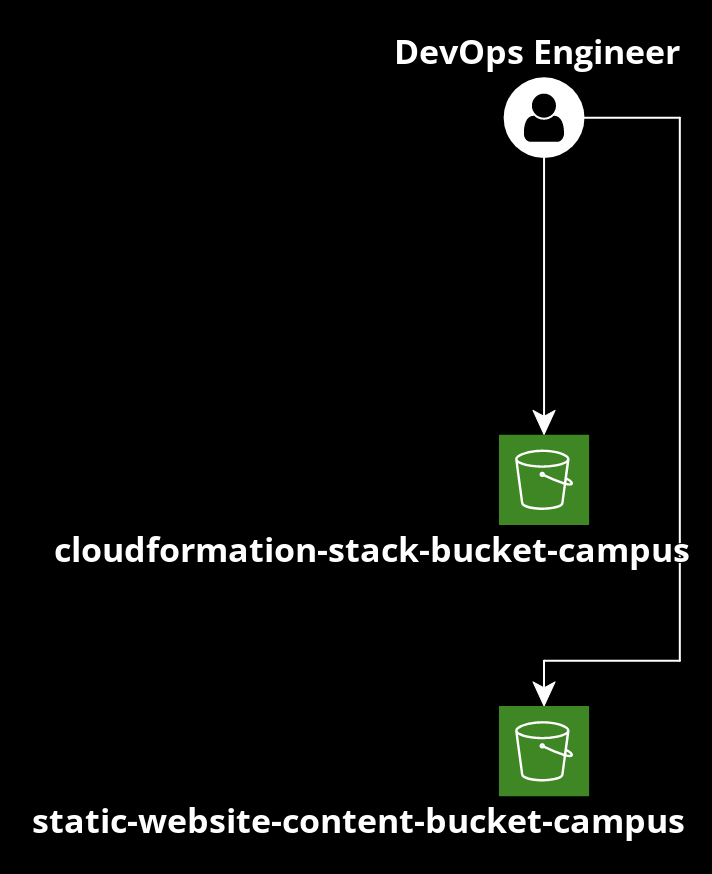

Diagram showing the resources that are created when the vpc-infra-setup.yml is deployed.
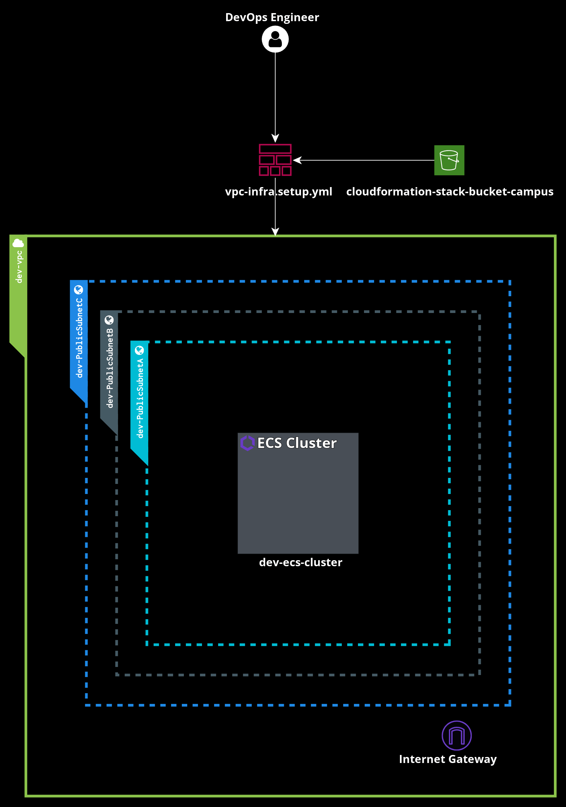

### The second stack will create the following resources

- CodeCommit Repository
- CodeBuild Project
- EC2 Instance (For starting the first CodeBuild Project)
  - This is a temporary resource that will be terminated after the first CodeBuild Project has been started. ECS Service requires a Docker image to be available in ECR before it can be started.
- CodePipeline Pipeline
- ECR Repository
- ECS Service
- ECS Task Definition
- ELB
- ALB Target Group
- Auto Scaling Group
- SNS Topic (Approval)
- Namespace for ECS Service Discovery

Diagram showing the resources that are created when the new-app-stack is deployed.

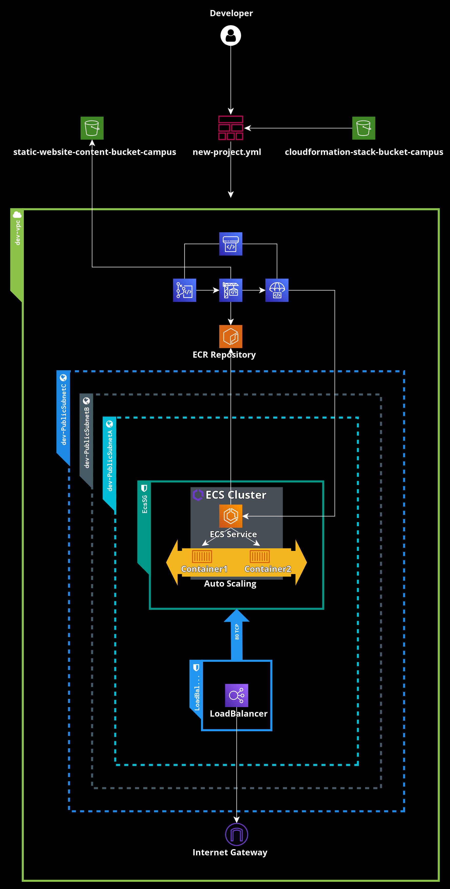

## Prerequisites

- AWS Account with correct permissions
- AWS CLI

## Initial Setup

The initial stack is deployed by the DevOps engineer. The stack will create the infrastructure that is needed for the application. We need to create two S3 buckets, one for storing the cloudformation stack and one for storing the static website content.

> **WARNING:** The S3 buckets must be globally unique. You need to change the bucket names in the commands below.

> **WARNING:** Make sure there is a file called `codecommit-basic-template.zip` in the `cloudformation-stack-bucket-campus` S3 bucket. The file is used by the CodeBuild project to create the initial CodeCommit repository.

- Example of `Dockerfile` to be included in `codecommit-basic-template.zip`:

```dockerfile
FROM nginx:alpine
EXPOSE 80
```

### File & Folder Structure

Below is showing the file and folder structure for the initial setup. It's important that the files are located in the correct folders as the commands below are expecting the files to be located in the correct folders. Feel free to change the folder structure, but make sure that you update the commands below.

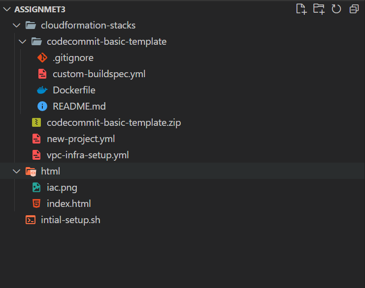

The commands below are located in `initial-setup.sh`. But you can also run them manually.

```bash
CLOUDFORMATION_STACK_BUCKET="cloudformation-stack-bucket-campus"
WEB_CONTENT_BUCKET="static-website-content-bucket-campus"
REGION="eu-west-1"

# Create a s3 bucket to store cloudformation stack
aws s3api create-bucket --bucket $CLOUDFORMATION_STACK_BUCKET --region $REGION --create-bucket-configuration LocationConstraint=$REGION

# Create a s3 bucket to store html folder (static website)
aws s3api create-bucket --bucket $WEB_CONTENT_BUCKET --region $REGION --create-bucket-configuration LocationConstraint=$REGION

# Upload cloudformation stack to s3 bucket
aws s3 cp ./cloudformation-stacks s3://$CLOUDFORMATION_STACK_BUCKET --recursive

# Upload html folder to s3 bucket, this will be copied when building our custom Docker image
aws s3 cp ./html s3://$WEB_CONTENT_BUCKET/html --recursive
```

### S3 Buckets Resources

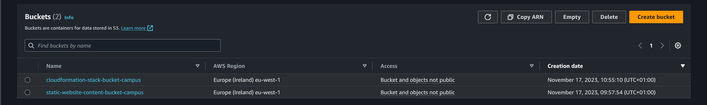

## vpc-infra-setup.yml Stack

After the S3 buckets have been created and the cloudformation stack has been uploaded to the S3 bucket, the VPC infrastructure can be created.

```bash
CLOUDFORMATION_STACK_BUCKET="cloudformation-stack-bucket-campus"
REGION="eu-west-1"
STACK_FILE="vpc-infra-setup.yml"
ENVIRONMENT=("dev" "prod")
###################### Create VPC Infrastructure and ECS Cluster ######################
# There are 2 parameters for the vpc-infra-setup.yml cloudformation template:
# 1. Environment: dev or prod (Default: dev)
# 2. EcsClusterName: The name of the ECS cluster (Default: ecs-cluster).
# It will be named as dev-ecs-cluster or prod-ecs-cluster depending on the environment parameter

# Create a stack for each environment, dev and prod
FOR env in "${ENVIRONMENT[@]}"; do
  aws cloudformation create-stack --stack-name "${ENVIRONMENT}net" \
  --template-url https://$CLOUDFORMATION_STACK_BUCKET.s3.$REGION.amazonaws.com/$STACK_FILE \
  --parameters ParameterKey=Environment,ParameterValue=$ENVIRONMENT --region $REGION
done
```

> **Some important notes about exporting and importing values between stacks**

The Stack is exporting some values that are needed for the new app stack. The values are exported with the help of CloudFormation `Export`.

In the new app stack, we are importing the values with the help of CloudFormation `!ImportValue`.

Values are exported in the VPC stack here:

```yaml
AWSTemplateFormatVersion: 2010-09-09
...
Parameters:
  Environment:
    Type: String
    Default: dev
    AllowedValues:
      - dev
      - prod
    Description: Environment to deploy to (dev or prod)
    ConstraintDescription: must be either dev or prod.
Resources:
...
Outputs:
  VpcId:
    Value: !Ref Vpc
    Export:
      Name: !Sub "${Environment}-VpcId"
```

Now we can import the value in the new app stack like this:
  
```yaml
AWSTemplateFormatVersion: 2010-09-09
...
Parameters:
...
Resources:
  EcsServiceSecurityGroup:
    Type: AWS::EC2::SecurityGroup
    Properties:
      GroupDescription: !Sub "Security group for ${EcrRepositoryName} ECS service"
      VpcId: !ImportValue dev-VpcId
      SecurityGroupIngress:
        - IpProtocol: tcp
          FromPort: !Ref HostPort
          ToPort: !Ref HostPort
          SourceSecurityGroupId: !Ref LoadBalancerSG
```

### VPC Resources Creation Resources

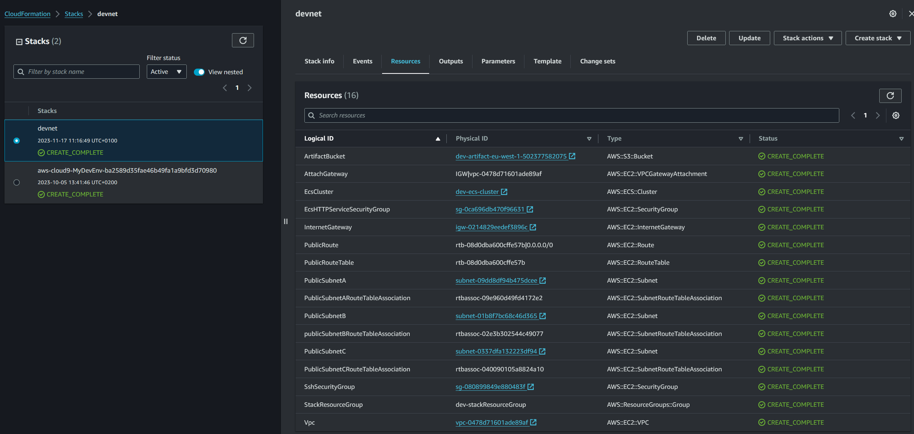

## new-project.yml Stack

The new app stack is deployed by the developers. The stack will create the resources that are needed for the application. Its important that the VPN infrastructure is created before the new app stack is deployed.

> **WARNING:** As Docker Hub has implemented pull rate limits, I have decided to use AWS Systems Manager Parameter Store to store the Docker Hub credentials. That will increase the pull rate limit, preventing the build from failing. The credentials are stored as a SecureString.

> **WARNING:** The Cloudformation stack will fail if the Docker Hub credentials are not stored in the Parameter Store.

Make sure that the Docker Hub credentials are stored in the Parameter Store before deploying the new app stack.

The stack is expecting the following parameters:
**`docker_user`** and **`docker_pass`**

Below is showing how Parameter Store should look like.

### AWS Systems Manager Parameter Store (For Docker Hub Credentials)

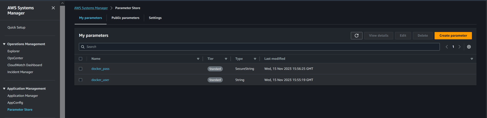

Once the Docker Hub credentials are stored in the Parameter Store, the new app stack can be deployed.

```bash
###################### Create a new CodeCommit Project ######################
# There are 4 parameters for the new-prject.yml cloudformation template:
# 1. CodeCommitRepositoryName: The name of the CodeCommit repository
# 2. EcrRepositoryName: The name of the ECR repository (Must be all lowercase)
# 3. ContainerPort: The port that the application is listening on (Default: 80)
# 4. HostPort: The port that the Load Balancer is listening on (Default: 80)
# We need to use --capabilities CAPABILITY_NAMED_IAM because we are creating a IAM role in the cloudformation template
APP_NAME="my-app"
ECR_REPO_NAME="my-app-repo"
STACK_NAME="my-app-stack"
STACK_FILE="new-project.yml"
REGION="eu-west-1"
CLOUDFORMATION_STACK_BUCKET="cloudformation-stack-bucket-campus"

aws cloudformation create-stack --stack-name $STACK_NAME \
--template-url https://$CLOUDFORMATION_STACK_BUCKET.s3.$REGION.amazonaws.com/$STACK_FILE \
--parameters ParameterKey=CodeCommitRepositoryName,ParameterValue=my-docker-app ParameterKey=EcrRepositoryName,ParameterValue=$ECR_REPO_NAME \
--region $REGION --capabilities CAPABILITY_NAMED_IAM
```

### New App Stack Resources

After the new app stack has been deployed, the resources below will be created. Below is showing the resources that are created when the stack is deployed.

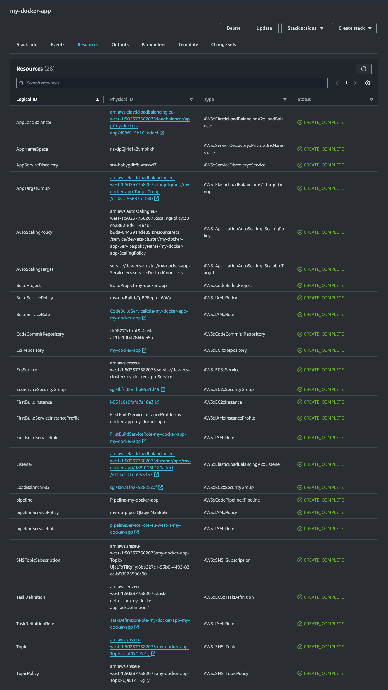

### CodeCommit Repository at creation

This is how the initial CodeCommit repository looks like when its created.
There are some sample files that are copied from the S3 bucket.
This is done by the CodeBuild project to ensure that the developers have a good starting point.

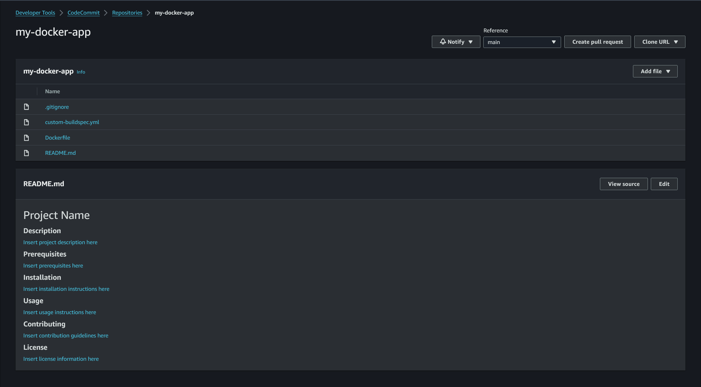

## SNS Topic Subscription Confirmation

When the new app stack is deployed, the project manager will receive an email from AWS SNS. The email contains a link that needs to be clicked to confirm the subscription.

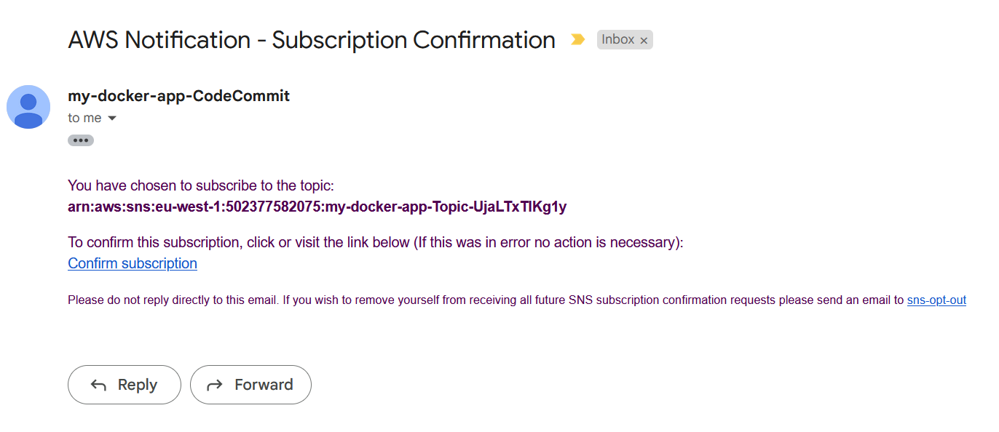

### Approval SNS Topic

This is how the SNS Topic looks like after the subscription has been confirmed and the pipeline has completed the deployment of the application.

The Load Balancer DNS name is included in the message body of the SNS Topic.

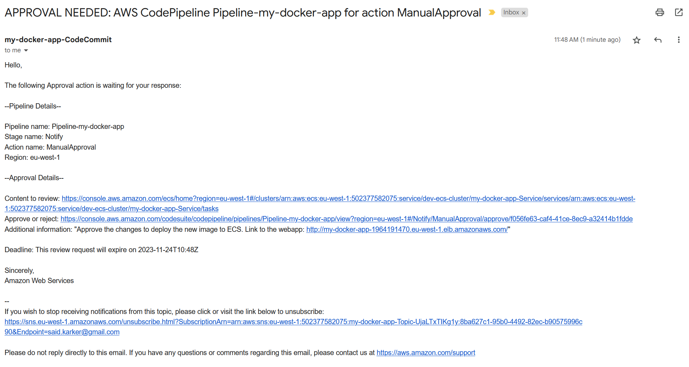

## Initial App Deployment

This is how the application looks like when the initial stack has been deployed. It's a simple nginx web server that is built from Dockerfile to a Docker image and then pushed to ECR.

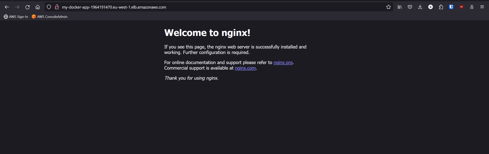

## Pipeline Approval

Here is the approval step in the pipeline. The project manager will receive an email from AWS SNS. The email contains a link that needs to be clicked to approve the deployment of the application.

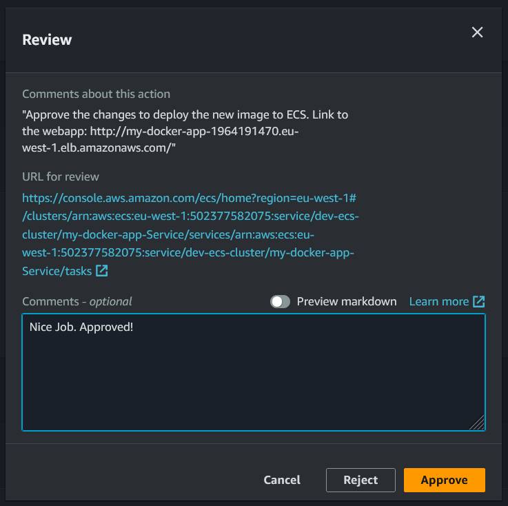

## Pipeline Process

This is how the pipeline looks like when the application is deployed.

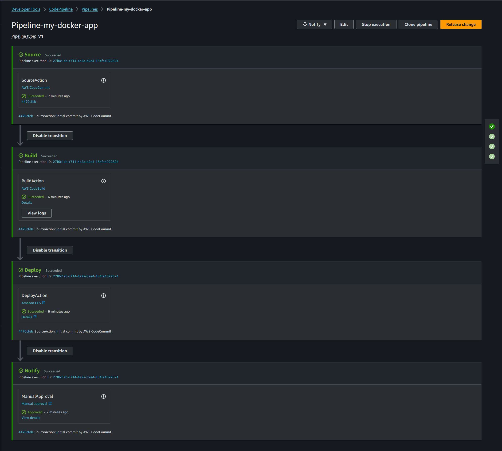

## ECR Repository

Here is the ECR repository that contains the Docker image for the application.

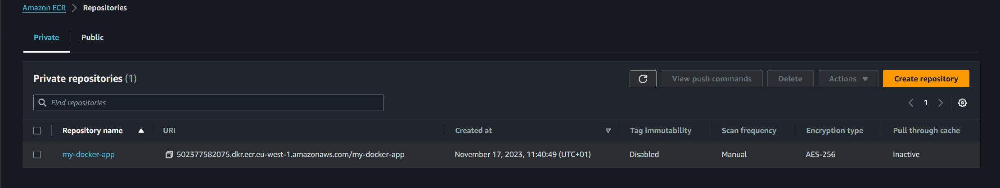

## ECS Cluster

We can see that the ECS cluster and its services.

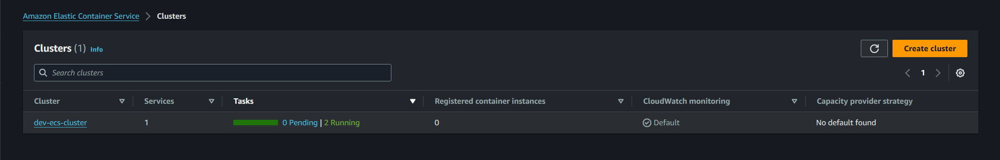

## ECS Service, Task and Load Balancer

ECS Service is running the task that is created by the CodeBuild project. The task is running the Docker image that is stored in ECR. The Load Balancer is pointing to the ECS Service with the help of the Target Group.
The application is utilizing ECS Service Discovery to register itself to the Load Balancer.

### ECS Service

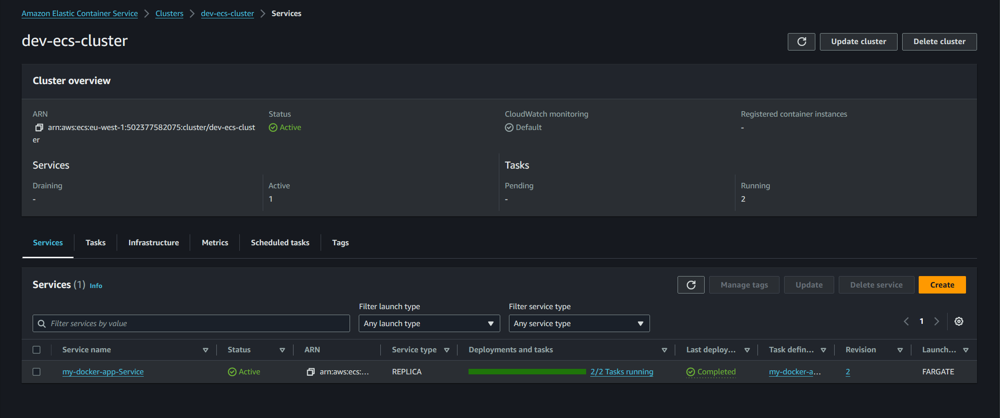

### ECS Task

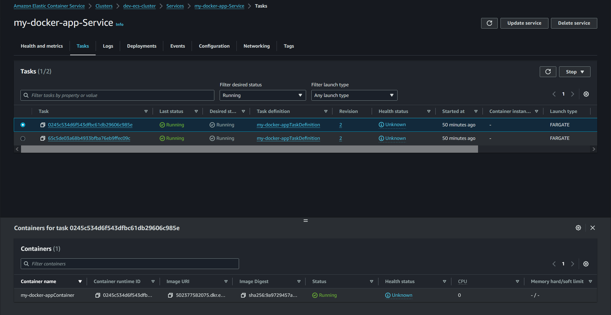

### Load Balancer

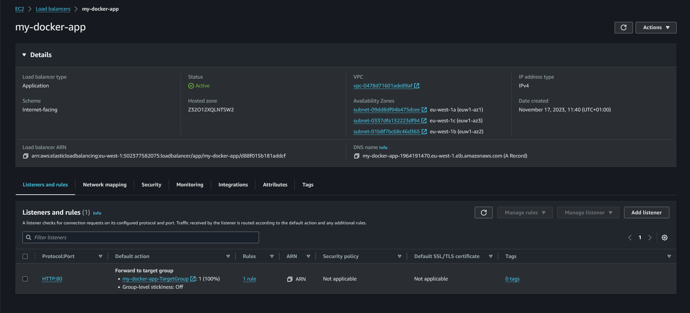

## App after Code Changes

This is how the application looks like after the code changes have been made and the pipeline has been triggered.

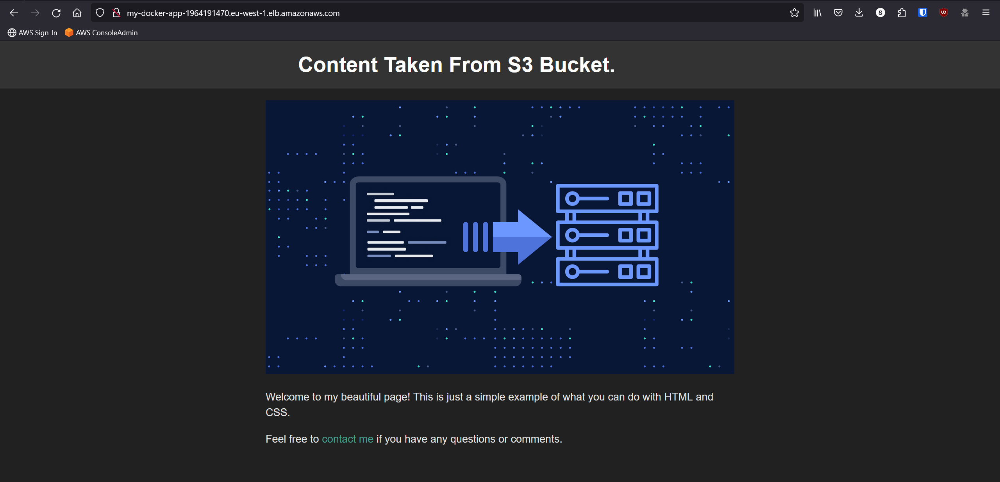

## The whole CloudFormation stacks

### vpc-infra-setup Stack

```yaml
---
AWSTemplateFormatVersion: 2010-09-09
Description: >
  Creating Network infrastructure and ECS Cluster for the development environment.

Parameters:
  Environment:
    Type: String
    Default: dev
    AllowedValues:
      - dev
      - prod
    Description: Environment to deploy to (dev or prod)
    ConstraintDescription: must be either dev or prod.

  EcsClusterName:
    Type: String
    Default: ecs-cluster
    Description: Specifies the ECS Cluster Name with which the resources would be associated

Mappings:
  Env:
    prod:
      VpcCIDR: 10.20.0.0/16
      PublicSubnetACIDR: 10.20.0.0/20
      PublicSubnetBCIDR: 10.20.16.0/20
      PublicSubnetCCIDR: 10.20.32.0/20
    dev:
      VpcCIDR: 10.10.0.0/16
      PublicSubnetACIDR: 10.10.0.0/20
      PublicSubnetBCIDR: 10.10.16.0/20
      PublicSubnetCCIDR: 10.10.32.0/20

Conditions:
  IsNotProd: !Not [!Equals [!Ref Environment, prod]]

Resources:
  ############################# VPC #############################
  Vpc:
    Type: AWS::EC2::VPC
    Properties:
      CidrBlock: !FindInMap [Env, !Ref Environment, VpcCIDR]
      EnableDnsSupport: true
      EnableDnsHostnames: true
      InstanceTenancy: default
      Tags:
        - Key: Name
          Value: !Sub "${Environment}-vpc"
        - Key: Environment
          Value: !Sub "${Environment}"

  InternetGateway:
    Type: AWS::EC2::InternetGateway
    DependsOn: Vpc
    Properties:
      Tags:
        - Key: Name
          Value: !Sub "${Environment}-igw"
        - Key: Environment
          Value: !Sub "${Environment}"

  AttachGateway:
    Type: AWS::EC2::VPCGatewayAttachment
    Properties:
      VpcId: !Ref Vpc
      InternetGatewayId: !Ref InternetGateway

  ############################# PUBLIC SUBNETS #############################
  PublicSubnetA:
    Type: AWS::EC2::Subnet
    Properties:
      AvailabilityZone: !Select
        - 0
        - Fn::GetAZs: !Ref AWS::Region
      VpcId: !Ref Vpc
      CidrBlock: !FindInMap [Env, !Ref Environment, PublicSubnetACIDR]
      MapPublicIpOnLaunch: true
      Tags:
        - Key: Name
          Value: !Sub "${Environment}-PublicSubnetA"
        - Key: Environment
          Value: !Sub "${Environment}"

  PublicSubnetB:
    Type: AWS::EC2::Subnet
    Properties:
      AvailabilityZone: !Select
        - 1
        - Fn::GetAZs: !Ref AWS::Region
      VpcId: !Ref Vpc
      CidrBlock: !FindInMap [Env, !Ref Environment, PublicSubnetBCIDR]
      MapPublicIpOnLaunch: true
      Tags:
        - Key: Name
          Value: !Sub "${Environment}-PublicSubnetB"
        - Key: Environment
          Value: !Sub "${Environment}"

  PublicSubnetC:
    Type: AWS::EC2::Subnet
    Properties:
      AvailabilityZone: !Select
        - 2
        - Fn::GetAZs: !Ref AWS::Region
      VpcId: !Ref Vpc
      CidrBlock: !FindInMap [Env, !Ref Environment, PublicSubnetCCIDR]
      MapPublicIpOnLaunch: true
      Tags:
        - Key: Name
          Value: !Sub "${Environment}-PublicSubnetC"
        - Key: Environment
          Value: !Sub "${Environment}"

  ############################# ROUTE TABLES #############################
  PublicRouteTable:
    Type: AWS::EC2::RouteTable
    Properties:
      VpcId: !Ref Vpc
      Tags:
        - Key: Name
          Value: !Sub "${Environment}-PublicRouteTable"
        - Key: Environment
          Value: !Sub "${Environment}"

  # Public route table has direct routing to IGW
  PublicRoute:
    Type: AWS::EC2::Route
    DependsOn: AttachGateway
    Properties:
      RouteTableId: !Ref PublicRouteTable
      DestinationCidrBlock: 0.0.0.0/0
      GatewayId: !Ref InternetGateway

  ############################# ROUTE TABLE ASSOCIATIONS #############################
  PublicSubnetARouteTableAssociation:
    Type: AWS::EC2::SubnetRouteTableAssociation
    Properties:
      SubnetId: !Ref PublicSubnetA
      RouteTableId: !Ref PublicRouteTable

  publicSubnetBRouteTableAssociation:
    Type: AWS::EC2::SubnetRouteTableAssociation
    Properties:
      SubnetId: !Ref PublicSubnetB
      RouteTableId: !Ref PublicRouteTable

  PublicSubnetCRouteTableAssociation:
    Type: AWS::EC2::SubnetRouteTableAssociation
    Properties:
      SubnetId: !Ref PublicSubnetC
      RouteTableId: !Ref PublicRouteTable

  ############################ ECS CLUSTER #############################
  SshSecurityGroup:
    Condition: IsNotProd
    Type: AWS::EC2::SecurityGroup
    Properties:
      GroupDescription: SSH Security Group
      VpcId: !Ref Vpc
      SecurityGroupIngress:
        - IpProtocol: tcp
          FromPort: 22
          ToPort: 22
          CidrIp: 0.0.0.0/0

  EcsHTTPServiceSecurityGroup:
    Condition: IsNotProd
    Type: AWS::EC2::SecurityGroup
    Properties:
      GroupDescription: ECS HTTP Service Security Group
      VpcId: !Ref Vpc
      SecurityGroupIngress:
        - IpProtocol: tcp
          FromPort: 80
          ToPort: 80
          CidrIp: 0.0.0.0/0

  EcsCluster:
    Type: AWS::ECS::Cluster
    Properties:
      ClusterName: !Sub "${Environment}-${EcsClusterName}"
      CapacityProviders:
      - FARGATE
      - FARGATE_SPOT
      ClusterSettings:
      - Name: containerInsights
        Value: disabled
      Configuration:
        ExecuteCommandConfiguration:
          Logging: DEFAULT
      ServiceConnectDefaults:
        Namespace: !Ref EcsClusterName
      Tags: 
        - Key: Name
          Value: !Sub "${Environment}-${EcsClusterName}"
        - Key: Environment
          Value: !Sub "${Environment}"

  StackResourceGroup:
    Type: "AWS::ResourceGroups::Group" 
    Properties: 
      Name: !Sub "${Environment}-stackResourceGroup"
      Description: "Resource group for the stack" 
      ResourceQuery: 
        Type: "CLOUDFORMATION_STACK_1_0"
      Tags:
        - Key: Type
          Value: "ResourceGroup"
        - Key: Environment
          Value: !Sub "${Environment}"
        - Key: Name
          Value: !Sub "${Environment}-ResourceGroup"

Outputs:
  VpcId:
    Value: !Ref Vpc
    Export:
      Name: !Sub "${Environment}-VpcId"

  PublicSubnetA:
    Value: !Ref PublicSubnetA
    Export:
      Name: !Sub "${Environment}-PublicSubnetA"

  PublicSubnetB:
    Value: !Ref PublicSubnetB
    Export:
      Name: !Sub "${Environment}-PublicSubnetB"

  PublicSubnetC:
    Value: !Ref PublicSubnetC
    Export:
      Name: !Sub "${Environment}-PublicSubnetC"

  HttpSecurityGroup:
    Condition: IsNotProd
    Value: !Ref EcsHTTPServiceSecurityGroup
    Export:
      Name: !Sub "${Environment}-HttpSecurityGroup"

  SshSecurityGroup:
    Condition: IsNotProd
    Value: !Ref SshSecurityGroup
    Export:
      Name: !Sub "${Environment}-SshSecurityGroup"

  ArtifactBucket:
    Condition: IsNotProd
    Value: cloudformation-stack-bucket-campus
    Export:
      Name: "ArtifactBucket"

  EcsCluster:
    Value: !Ref EcsCluster
    Export:
      Name: !Sub "${Environment}-EcsCluster"

  AccountId:
    Value: !Ref AWS::AccountId
    Export:
      Name: !Sub "${Environment}-AccountId"
```

### new-project Stack

```yaml
---
AWSTemplateFormatVersion: 2010-09-09
Description: >
  This template creates a CodePipeline for developers to deploy their code to. It will create a CodeCommit repository, a CodeBuild project, and a CodePipeline pipeline.

Parameters:

  CodeCommitRepositoryName:
    Type: String
    AllowedPattern: ^[a-zA-Z0-9._\-]+(?<!\.git)$
    Description: Enter a name for the CodeCommit repository to create
    ConstraintDescription: must be a valid CodeCommit repository name.

  EcrRepositoryName:
    Type: String
    Default: testecrrepo
    AllowedPattern: ^[a-z0-9/-]{2,256}$
    Description: Enter a name for the ECR repository to create (must be lowercase) (e.g. mycontainerrepo)
    ConstraintDescription: >
      The ECR repository name must start with a letter and can only contain lowercase letters, numbers, hyphens, underscores, and forward slashes.

  ContainerPort:
    Type: Number
    Default: 80
    Description: Enter the port number that the container listens on (e.g. 80)

  HostPort:
    Type: Number
    Default: 80
    Description: Enter the port number that the load balancer listens on (e.g. 80)

Mappings:
  RegionMap:
    # Details for eu-west-1
    eu-west-1:
      InstanceType: t2.micro
      AMI: ami-0f3164307ee5d695a
      SSHKeyName: aws_rsa.pub
      ApprovalEmail: "user@email.com"
    # Details for eu-north-1
    eu-north-1:
      InstanceType: t3.micro
      AMI: ami-071df4a41c6f9ee2e
      SSHKeyName: aws_rsa.pub
      ApprovalEmail: "user@email.com"

Resources:
  TopicPolicy:
    Type: AWS::SNS::TopicPolicy
    Properties: 
      PolicyDocument:
        Version: '2012-10-17'
        Statement:
          - 
            Sid: AllowPublish
            Effect: Allow
            Principal:
              Service:
                - 'codestar-notifications.amazonaws.com'
            Action:
              - 'SNS:Publish'
            Resource:
              - !Ref Topic
      Topics: 
        - !Ref Topic

# Create a sns topic
  Topic:
    Type: AWS::SNS::Topic
    Properties:
      DisplayName: !Sub "${CodeCommitRepositoryName}-CodeCommit"
      Subscription:
        - Endpoint: !FindInMap [RegionMap, !Ref "AWS::Region", ApprovalEmail]
          Protocol: email

  # Create a sns topic subscription
  SNSTopicSubscription:
    Type: AWS::SNS::Subscription
    Properties:
      Endpoint: !FindInMap [RegionMap, !Ref "AWS::Region", ApprovalEmail]
      Protocol: email
      TopicArn: !Ref Topic

  # Create a CodeCommit Repository
  CodeCommitRepository:
    Type: AWS::CodeCommit::Repository
    Properties:
      RepositoryName: !Ref CodeCommitRepositoryName
      Triggers:
        - Name: Trigger
          CustomData: The Code Repository
          DestinationArn: !Ref Topic
          Branches:
            - main
          Events: [all]
      Code:
        BranchName: main
        S3:
          Bucket: !ImportValue ArtifactBucket
          Key: "codecommit-basic-template.zip"
      Tags:
        - Key: Name
          Value: !Sub "${CodeCommitRepositoryName}-${AWS::StackName}"

  # Create a ECR Repository for the images
  EcrRepository: 
    Type: AWS::ECR::Repository
    Properties:
      EmptyOnDelete: true # Delete the repository when the stack is deleted, even if it's not empty, NOT RECOMMENDED FOR PRODUCTION
      RepositoryName: !Ref EcrRepositoryName
      ImageScanningConfiguration: 
        ScanOnPush: false

############################################## CodeBuild ##############################################
  BuildServiceRole:
    Type: AWS::IAM::Role
    Properties:
      RoleName: !Sub "CodeBuildServiceRole-${CodeCommitRepositoryName}-${AWS::StackName}"
      AssumeRolePolicyDocument:
        Version: "2012-10-17"
        Statement:
          - Effect: Allow
            Principal:
              Service:
                - codebuild.amazonaws.com
                - ec2.amazonaws.com
            Action:
              - sts:AssumeRole
      ManagedPolicyArns:
        - arn:aws:iam::aws:policy/AmazonEC2ContainerRegistryPowerUser

  BuildServicePolicy:
    Type: AWS::IAM::Policy
    DependsOn: 
      - EcrRepository
      # - BuildProject
      - CodeCommitRepository
    Properties:
      PolicyName: !Sub "CodeBuildPolicy-${CodeCommitRepositoryName}-${AWS::StackName}"
      Roles: 
        - !Ref BuildServiceRole
      PolicyDocument:
        Version: '2012-10-17'
        Statement:
          - Effect: Allow
            Action:
              - logs:CreateLogGroup
              - logs:CreateLogStream
              - logs:PutLogEvents
            Resource:
              - !Sub "arn:aws:logs:${AWS::Region}:${AWS::AccountId}:log-group:/aws/codebuild/BuildProject-${CodeCommitRepositoryName}" # CodeBuild logs
              - !Sub "arn:aws:logs:${AWS::Region}:${AWS::AccountId}:log-group:/aws/codebuild/BuildProject-${CodeCommitRepositoryName}:*" # CodeBuild logs
          - Effect: Allow
            Action:
              - s3:GetObject
              - s3:PutObject
              # - s3:GetObjectAcl
              - s3:GetObjectVersion
              - s3:GetBucketAcl
              - s3:GetBucketLocation
              - s3:ListBucket
            Resource:
              - !Sub "arn:aws:s3:::codepipeline-${AWS::Region}-*" # CodePipeline artifacts bucket
              - "arn:aws:s3:::static-website-content-bucket-campus*" # For testing purposes only
          - Effect: Allow
            Action:
              - codecommit:GitPull
            Resource:
              - !Sub "arn:aws:codecommit:${AWS::Region}:${AWS::AccountId}:${CodeCommitRepositoryName}" # CodeCommit repository
          - Effect: Allow
            Action:
              - codebuild:CreateReportGroup
              - codebuild:CreateReport
              - codebuild:UpdateReport
              - codebuild:BatchPutTestCases
              - codebuild:BatchPutCodeCoverages
            Resource:
              - !Sub "arn:aws:codebuild:${AWS::Region}:${AWS::AccountId}:report-group/BuildProject-${CodeCommitRepositoryName}-*" # CodeBuild reports
          - Effect: Allow
            Action:
              - ssm:GetParameters
              - ssm:GetParametersByPath
            Resource: !Sub "arn:aws:ssm:${AWS::Region}:${AWS::AccountId}:*"

  BuildProject:
    Type: AWS::CodeBuild::Project
    Properties:
      Name: !Sub "BuildProject-${CodeCommitRepositoryName}"
      Description: !Sub "BuildProject for ${CodeCommitRepositoryName} - Stack: ${AWS::StackName}"
      ServiceRole: !Ref BuildServiceRole
      Artifacts:
        Type: NO_ARTIFACTS
      BadgeEnabled: false
      Cache:
        Type: NO_CACHE
      Environment: # use Ubuntu standard v7
        Type: LINUX_CONTAINER
        ComputeType: BUILD_GENERAL1_SMALL
        Image: aws/codebuild/standard:7.0
        ImagePullCredentialsType: CODEBUILD
        PrivilegedMode: true
      TimeoutInMinutes: 15
      QueuedTimeoutInMinutes: 480
      LogsConfig:
        CloudWatchLogs:
          Status: ENABLED
        S3Logs:
          Status: DISABLED
      Source:
        GitCloneDepth: 1
        GitSubmodulesConfig:
          FetchSubmodules: false
        Type: CODECOMMIT
        Location: !Sub "https://git-codecommit.${AWS::Region}.amazonaws.com/v1/repos/${CodeCommitRepositoryName}"
        BuildSpec: !Sub |
          version: 0.2
          env:
            parameter-store:
              DOCKER_USER: "docker_user"
              DOCKER_PASS: "docker_pass"
          phases:
            pre_build:
              commands:
                - echo "Logging in to Docker hub (Creds from Parameter Store)..."
                - docker login -u $DOCKER_USER -p $DOCKER_PASS
                # Fill in AWS information
                - ACCOUNT_ID=${AWS::AccountId}
                - REGION=${AWS::Region}
                - REGISTRY_URI=502377582075.dkr.ecr.$REGION.amazonaws.com
                # Fill in Docker information
                - IMAGE_NAME=${EcrRepository}
                # Fill in ECS information
                - CONTAINER_NAME=${EcrRepository}Container # TaskDefinition: container definition name (Wrapper for imageUri)
                # -----------------------
                - IMAGE=$REGISTRY_URI/$IMAGE_NAME
                - COMMIT=$(echo $CODEBUILD_RESOLVED_SOURCE_VERSION | cut -c 1-8)
                - aws ecr get-login-password --region $REGION | docker login --username AWS --password-stdin $REGISTRY_URI
            build:
              commands:
                - docker build --build-arg AWS_DEFAULT_REGION=$AWS_DEFAULT_REGION --build-arg AWS_CONTAINER_CREDENTIALS_RELATIVE_URI=$AWS_CONTAINER_CREDENTIALS_RELATIVE_URI --tag $IMAGE .
                # - docker build --tag $IMAGE .
                - docker tag $IMAGE $IMAGE:$COMMIT
            post_build:
              commands:
                - docker push $IMAGE
                - docker push $IMAGE:$COMMIT
                # Create imagedefinitions.json. This is used by ECS to know which docker image to use.
                - printf '[{"name":"%s","imageUri":"%s"}]' $CONTAINER_NAME $IMAGE:$COMMIT > imagedefinitions.json
          artifacts:
            files:
              # Put imagedefinitions.json in the artifact zip file
              - imagedefinitions.json

  FirstBuildServiceRole:
    Type: AWS::IAM::Role
    Properties:
      RoleName: !Sub "FirstBuildServiceRole-${CodeCommitRepositoryName}-${AWS::StackName}"
      AssumeRolePolicyDocument:
        Version: "2012-10-17"
        Statement:
          - Effect: Allow
            Principal:
              Service:
                - ec2.amazonaws.com
            Action:
              - sts:AssumeRole
      ManagedPolicyArns:
        - arn:aws:iam::aws:policy/AWSCodeBuildDeveloperAccess

  FirstBuildServiceInstanceProfile:
    Type: AWS::IAM::InstanceProfile
    Properties:
      InstanceProfileName: !Sub "FirstBuildServiceInstanceProfile-${CodeCommitRepositoryName}-${AWS::StackName}"
      Roles:
        - !Ref FirstBuildServiceRole

  # Create a EC2 instance to start the first build
  FirstBuildInstance:
    Type: AWS::EC2::Instance
    Properties:
      SecurityGroupIds:
        - !ImportValue dev-SshSecurityGroup
      IamInstanceProfile: !Ref FirstBuildServiceInstanceProfile
      ImageId: !FindInMap [RegionMap, !Ref "AWS::Region", AMI]
      InstanceType: !FindInMap [RegionMap, !Ref "AWS::Region", InstanceType]
      # Terminate the instance when the provisioning is done
      InstanceInitiatedShutdownBehavior: terminate
      KeyName: !FindInMap [RegionMap, !Ref "AWS::Region", SSHKeyName]
      SubnetId: !ImportValue dev-PublicSubnetA
      Tags:
        - Key: Name
          Value: !Sub "${AWS::StackName}-firstbuild-provioner"
      UserData: 
        Fn::Base64: !Sub |
          #!/bin/bash -x

          BuildProject=${BuildProject}
          counter=0

          while [ $counter -lt 10 ]; do
              # Start the build job and get the build id
              build_id=$(aws codebuild start-build --project-name $BuildProject --query 'build.id' --output text)
              # Get the build status from the response
              status=$(aws codebuild batch-get-builds --ids $build_id --query 'builds[0].buildStatus' --output text)

              # Wait for the build to be IN_PROGRESS before allowing a new build
              while [ "$status" == "IN_PROGRESS" ]; do
                  # Add a delay before checking the status again
                  sleep 10

                  status=$(aws codebuild batch-get-builds --ids $build_id --query 'builds[0].buildStatus' --output text)
                  if [ "$status" == "IN_PROGRESS" ]; then
                      echo "Build is in progress. Waiting..."
                  fi
              done

              # Increment the counter
              ((counter++))

              # Check the status of the build (you might need to adjust this based on the actual output)
              status=$(aws codebuild batch-get-builds --ids $build_id --query 'builds[0].buildStatus' --output text)

              # Check if the status is 0 (Succeeded)
              if [ "$status" == "SUCCEEDED" ]; then
                  echo "Build succeeded!"
                  break
              elif [ "$status" == "FAILED" ]; then
                  echo "Build failed. Retrying..."
              fi

              # Add a delay before the next iteration (you can adjust the sleep time as needed)
              sleep 10
          done

          echo "Build $status after $counter attempts"

          if [ "$status" == "SUCCEEDED" ]; then
              shutdown -h now
          fi

  # Service Discovery Namespace for the application (ECS Service Discovery)
  AppServiceDiscovery:
    Type: AWS::ServiceDiscovery::Service
    Properties:
      Description: Service Discovery for the application
      DnsConfig:
        DnsRecords:
          - Type: A
            TTL: 60
        RoutingPolicy: MULTIVALUE
      HealthCheckCustomConfig:
        FailureThreshold: 1
      Name: !Sub "${EcrRepositoryName}-AppService"
      NamespaceId: !Ref AppNameSpace

  AppNameSpace:
    Type: 'AWS::ServiceDiscovery::PrivateDnsNamespace'
    Properties:
      Description: Namespace for the application
      Vpc: !ImportValue dev-VpcId
      Name: !Sub "${EcrRepositoryName}-AppNamespace"
      Properties:
        DnsProperties:
          SOA:
            TTL: 100

############################################## ECS Task Definition ##############################################
  TaskDefinitionRole:
    Type: AWS::IAM::Role
    Properties:
      RoleName: !Sub "TaskDefinitionRole-${EcrRepositoryName}-${AWS::StackName}"
      AssumeRolePolicyDocument:
        Version: "2012-10-17"
        Statement:
          - Effect: Allow
            Principal:
              Service:
                - ecs-tasks.amazonaws.com
            Action:
              - sts:AssumeRole
      ManagedPolicyArns:
        - arn:aws:iam::aws:policy/service-role/AmazonECSTaskExecutionRolePolicy
        - arn:aws:iam::aws:policy/CloudWatchLogsFullAccess # CloudWatch Logs

  # ECS Task Definition
  TaskDefinition:
    Type: AWS::ECS::TaskDefinition
    Properties:
      Family: !Sub "${EcrRepositoryName}TaskDefinition"
      Cpu: 256
      Memory: 512
      RuntimePlatform:
        OperatingSystemFamily: LINUX
        CpuArchitecture: X86_64
      NetworkMode: awsvpc
      RequiresCompatibilities:
        - FARGATE
      ExecutionRoleArn: !GetAtt TaskDefinitionRole.Arn
      ContainerDefinitions:
        - Name: !Sub "${EcrRepositoryName}Container"
          Image: !Sub "${AWS::AccountId}.dkr.ecr.${AWS::Region}.amazonaws.com/${EcrRepositoryName}"
          PortMappings:
            - Name: !Sub "${EcrRepositoryName}-${ContainerPort}-tcp"
              ContainerPort: !Ref ContainerPort
              HostPort: !Ref HostPort
              Protocol: tcp
              AppProtocol: http
          LogConfiguration:
            LogDriver: awslogs
            Options:
              awslogs-create-group: true
              awslogs-group: !Sub "${EcrRepositoryName}TaskDefinition"
              awslogs-region: !Ref AWS::Region
              awslogs-stream-prefix: ecs


############################################## ECS Service ##############################################
  EcsServiceSecurityGroup:
    Type: AWS::EC2::SecurityGroup
    Properties:
      GroupDescription: !Sub "Security group for ${EcrRepositoryName} ECS service"
      VpcId: !ImportValue dev-VpcId
      SecurityGroupIngress:
        - IpProtocol: tcp
          FromPort: !Ref HostPort
          ToPort: !Ref HostPort
          SourceSecurityGroupId: !Ref LoadBalancerSG

  EcsService:
    DependsOn:
      - FirstBuildInstance
      - Listener
      - AppLoadBalancer
    Type: AWS::ECS::Service
    Properties:
      Cluster: !ImportValue dev-EcsCluster
      LaunchType: FARGATE
      PlatformVersion: LATEST
      TaskDefinition: !Ref TaskDefinition
      SchedulingStrategy: REPLICA
      DesiredCount: 1
      DeploymentConfiguration:
        MaximumPercent: 200
        MinimumHealthyPercent: 0
        DeploymentCircuitBreaker:
          Enable: true
          Rollback: true
      NetworkConfiguration:
        AwsvpcConfiguration:
          AssignPublicIp: ENABLED
          SecurityGroups:
            - !Ref EcsServiceSecurityGroup
          Subnets:
            - !ImportValue dev-PublicSubnetA
            - !ImportValue dev-PublicSubnetB
            - !ImportValue dev-PublicSubnetC
      LoadBalancers:
        - ContainerName: !Sub "${EcrRepositoryName}Container"
          ContainerPort: 80
          TargetGroupArn:
            Ref: AppTargetGroup

      ServiceName: !Sub "${EcrRepositoryName}-Service"
      DeploymentController:
        Type: ECS
      ServiceConnectConfiguration:
        Enabled: false
        Namespace: !Ref AppServiceDiscovery
      Tags: []
      EnableECSManagedTags: true

  LoadBalancerSG:
    Type: AWS::EC2::SecurityGroup
    Properties:
      GroupDescription: Security group for the load balancer to allow inbound traffic
      VpcId: !ImportValue dev-VpcId
      SecurityGroupIngress:
        - IpProtocol: tcp
          FromPort: 80
          ToPort: 80
          CidrIp: 0.0.0.0/0

############################################## Load Balancer ##############################################
  AppLoadBalancer:
    Type: AWS::ElasticLoadBalancingV2::LoadBalancer
    Properties:
      Type: application
      Name: !Sub "${EcrRepositoryName}"
      SecurityGroups:
        - !Ref LoadBalancerSG
      Subnets:
        - !ImportValue dev-PublicSubnetA
        - !ImportValue dev-PublicSubnetB
        - !ImportValue dev-PublicSubnetC

  AppTargetGroup:
    Type: AWS::ElasticLoadBalancingV2::TargetGroup
    Properties:
      HealthCheckPath: /
      Name: !Sub "${EcrRepositoryName}-TargetGroup"
      Port: !Ref HostPort
      Protocol: HTTP
      TargetType: ip
      HealthCheckProtocol: HTTP
      VpcId: !ImportValue dev-VpcId

  Listener:
    Type: AWS::ElasticLoadBalancingV2::Listener
    Properties:
      DefaultActions:
        - Type: forward
          TargetGroupArn:
            Ref: AppTargetGroup
      LoadBalancerArn:
        Ref: AppLoadBalancer
      Port: !Ref HostPort
      Protocol: HTTP

############################################## AutoScaling ##############################################
  AutoScalingTarget:
    Type: AWS::ApplicationAutoScaling::ScalableTarget
    Properties:
      MaxCapacity: 4
      MinCapacity: 2
      ResourceId: !Join
        - /
        - - service
          - !ImportValue dev-EcsCluster
          - !GetAtt EcsService.Name
      RoleARN: !Sub "arn:aws:iam::${AWS::AccountId}:role/aws-service-role/ecs.application-autoscaling.amazonaws.com/AWSServiceRoleForApplicationAutoScaling_ECSService"
      ScalableDimension: ecs:service:DesiredCount
      ServiceNamespace: ecs

  AutoScalingPolicy:
    Type: AWS::ApplicationAutoScaling::ScalingPolicy
    Properties:
      PolicyName: !Sub "${EcrRepositoryName}-ScalingPolicy"
      PolicyType: TargetTrackingScaling
      ScalingTargetId:
        Ref: AutoScalingTarget
      TargetTrackingScalingPolicyConfiguration:
        TargetValue: '70'
        PredefinedMetricSpecification:
          PredefinedMetricType: ECSServiceAverageCPUUtilization

############################################## CodePipeline ##############################################
  pipelineServiceRole:
    Type: AWS::IAM::Role
    Properties:
      RoleName: !Sub "pipelineServiceRole-${AWS::Region}-${CodeCommitRepositoryName}"
      AssumeRolePolicyDocument:
        Version: "2012-10-17"
        Statement:
          - Effect: Allow
            Principal:
              Service:
                - codepipeline.amazonaws.com
            Action:
              - sts:AssumeRole
      ManagedPolicyArns:
        - arn:aws:iam::aws:policy/AWSCodePipeline_FullAccess

  pipelineServicePolicy:
    Type: AWS::IAM::Policy
    DependsOn: 
      - EcrRepository
      - BuildProject
      - CodeCommitRepository
    Properties:
      PolicyName: !Sub "pipelineServicePolicy-${AWS::Region}-${CodeCommitRepositoryName}"
      Roles: 
        - !Ref pipelineServiceRole
      PolicyDocument:
        Version: '2012-10-17'
        Statement:
        - Action:
          - codecommit:CancelUploadArchive
          - codecommit:GetBranch
          - codecommit:GetCommit
          - codecommit:GetRepository
          - codecommit:GetUploadArchiveStatus
          - codecommit:UploadArchive
          Resource: "*"
          Effect: Allow
        - Action:
          - iam:PassRole
          Resource: "*"
          Effect: Allow
          Condition:
            StringEqualsIfExists:
              iam:PassedToService:
              - cloudformation.amazonaws.com
              - elasticbeanstalk.amazonaws.com
              - ec2.amazonaws.com
              - ecs-tasks.amazonaws.com
        - Action:
          - codedeploy:CreateDeployment
          - codedeploy:GetApplication
          - codedeploy:GetApplicationRevision
          - codedeploy:GetDeployment
          - codedeploy:GetDeploymentConfig
          - codedeploy:RegisterApplicationRevision
          Resource: "*"
          Effect: Allow
        - Action:
          - codestar-connections:UseConnection
          Resource: "*"
          Effect: Allow
        - Action:
          - elasticbeanstalk:*
          - ec2:*
          - elasticloadbalancing:*
          - autoscaling:*
          - cloudwatch:*
          - s3:*
          - sns:*
          - cloudformation:*
          - rds:*
          - sqs:*
          - ecs:*
          Resource: "*"
          Effect: Allow
        - Action:
          - lambda:InvokeFunction
          - lambda:ListFunctions
          Resource: "*"
          Effect: Allow
        - Action:
          - opsworks:CreateDeployment
          - opsworks:DescribeApps
          - opsworks:DescribeCommands
          - opsworks:DescribeDeployments
          - opsworks:DescribeInstances
          - opsworks:DescribeStacks
          - opsworks:UpdateApp
          - opsworks:UpdateStack
          Resource: "*"
          Effect: Allow
        - Action:
          - cloudformation:CreateStack
          - cloudformation:DeleteStack
          - cloudformation:DescribeStacks
          - cloudformation:UpdateStack
          - cloudformation:CreateChangeSet
          - cloudformation:DeleteChangeSet
          - cloudformation:DescribeChangeSet
          - cloudformation:ExecuteChangeSet
          - cloudformation:SetStackPolicy
          - cloudformation:ValidateTemplate
          Resource: "*"
          Effect: Allow
        - Action:
          - codebuild:BatchGetBuilds
          - codebuild:StartBuild
          - codebuild:BatchGetBuildBatches
          - codebuild:StartBuildBatch
          Resource: "*"
          Effect: Allow
        - Effect: Allow
          Action:
          - devicefarm:ListProjects
          - devicefarm:ListDevicePools
          - devicefarm:GetRun
          - devicefarm:GetUpload
          - devicefarm:CreateUpload
          - devicefarm:ScheduleRun
          Resource: "*"
        - Effect: Allow
          Action:
          - servicecatalog:ListProvisioningArtifacts
          - servicecatalog:CreateProvisioningArtifact
          - servicecatalog:DescribeProvisioningArtifact
          - servicecatalog:DeleteProvisioningArtifact
          - servicecatalog:UpdateProduct
          Resource: "*"
        - Effect: Allow
          Action:
          - cloudformation:ValidateTemplate
          Resource: "*"
        - Effect: Allow
          Action:
          - ecr:DescribeImages
          Resource: "*"
        - Effect: Allow
          Action:
          - states:DescribeExecution
          - states:DescribeStateMachine
          - states:StartExecution
          Resource: "*"
        - Effect: Allow
          Action:
          - appconfig:StartDeployment
          - appconfig:StopDeployment
          - appconfig:GetDeployment
          Resource: "*"

  pipeline:
    Type: AWS::CodePipeline::Pipeline
    Properties:
      Name: !Sub "Pipeline-${CodeCommitRepositoryName}"
      RoleArn: !GetAtt pipelineServiceRole.Arn
      ArtifactStore:
        Type: S3
        Location: "codepipeline-eu-west-1-969941146089"
      Stages:
        - Name: Source
          Actions:
            - Name: SourceAction
              ActionTypeId:
                Category: Source
                Owner: AWS
                Version: 1
                Provider: CodeCommit
              OutputArtifacts:
                - Name: SourceOutput
              Configuration:
                RepositoryName: !Ref CodeCommitRepositoryName
                BranchName: main
              RunOrder: 1
        - Name: Build
          Actions:
            - Name: BuildAction
              ActionTypeId:
                Category: Build
                Owner: AWS
                Version: 1
                Provider: CodeBuild
              InputArtifacts:
                - Name: SourceOutput
              OutputArtifacts:
                - Name: BuildOutput
              Configuration:
                ProjectName: !Ref BuildProject
              RunOrder: 1
        - Name: Deploy
          Actions:
            - Name: DeployAction
              ActionTypeId:
                Category: Deploy
                Owner: AWS
                Version: 1
                Provider: ECS
              InputArtifacts:
                - Name: BuildOutput
              Configuration:
                ClusterName: !ImportValue dev-EcsCluster
                ServiceName: !Ref EcsService
                FileName: imagedefinitions.json
        - Name: Notify
          Actions:
            - Name: ManualApproval
              ActionTypeId:
                Category: Approval
                Owner: AWS
                Version: 1
                Provider: Manual
              Configuration:
                CustomData: !Sub  >
                  "Approve the changes to deploy the new image to ECS.
                  Link to the webapp: http://${AppLoadBalancer.DNSName}/"
                ExternalEntityLink: !Sub "https://console.aws.amazon.com/ecs/home?region=${AWS::Region}#/clusters/${EcsService}/services/${EcsService}/tasks"
                NotificationArn: !Ref Topic
              RunOrder: 1

Outputs:
  CodeCommitRepositoryCloneUrlHttp:
    Description: "CodeCommit repository clone URL over HTTPS"
    Value: !Sub "https://git-codecommit.${AWS::Region}.amazonaws.com/v1/repos/${CodeCommitRepositoryName}"

  AppLoadBalancerDNSName:
    Description: "DNS name of the load balancer"
    Value: !GetAtt AppLoadBalancer.DNSName

  buildProjectName:
    Description: "CodeBuild project name"
    Value: !Ref BuildProject
```

## Conclusion

This project was a great learning experience for me. I learned a lot about CI/CD workflow in AWS and how to use AWS services to build a CI/CD pipeline. I also learned how to use AWS CloudFormation to create and manage AWS resources. I always had the developer user experience in my mind when working with this project. The idea was to get the developer to focus on writing code and not worry about the infrastructure. I think I achieved that goal, at least to some extent.
