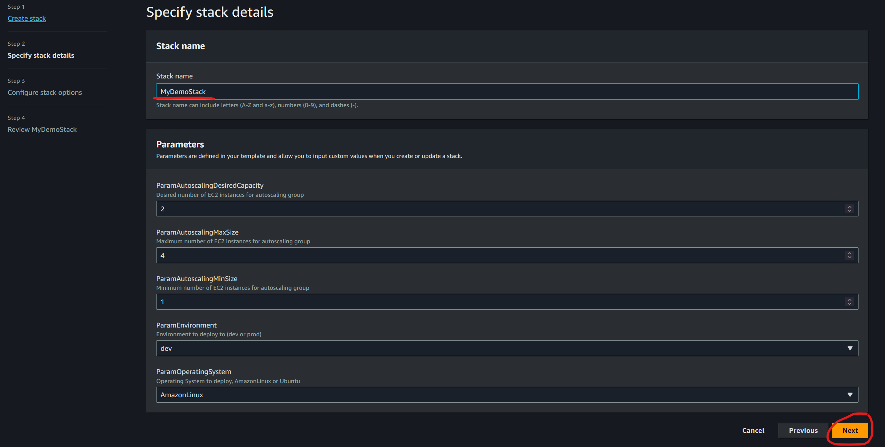

# V1 Projekt - Robust, säker och skalbar webbapplikation

## Innehåll

- Motivering
- Krav
- Arkitektur
- Template (CloudFormation)

## Motivering

Det finns många olika sätt att bygga en webbapplikation. Det kan antigen vara helt manuellt, hybrid eller helt automatiserat. Jag har valt att provisionera helt automatiskt med hjälp av AWS CloudFormation. Detta för att det är enkelt att återskapa miljön och det är lätt att skala upp och ner. Det är oerhört viktigt att ha en "disaster recovery" plan. Detta för att kunna snabbt återskapa miljön om något skulle hända.

## Krav

- [x] Skalbar
  - [x] Auto Scaling Group som skalar upp och ner beroende på belastning
- [x] Säker
  - [x] Endast port 80 öppen för trafik genom Load Balancer
- [x] Robust
  - [x] Auto Scaling Group
  - [x] Load Balancer för att fördela trafiken
- [x] Dynamisk template som kan återskapas i olika regioner

## Arkitektur

Här nedan kan se hur akitekturen är designat.

- Två stycken Security Groups
  - En för EC2 instanserna Launch Template
    - Öppen för port 80 från Load Balancern endast.
  - En för Load Balancern
    - Öppen för port 80 från överallt.
- En Launch Template
  - Skapar EC2 instanser
  - Installerar nginx
  - Skriver ut en hemsida med namnet på stacken och hostname
- En Target Group för Load Balancern med diverse hälsokontroller
- En Load Balancer
  - Tar emot trafik på port 80
  - Skickar trafiken vidare till EC2 instanserna
- En Auto Scaling Group som är kopplad till EC2 Launch Template Resources
  - Skalar upp och ner beroende på belastning


## Template (CloudFormation)

Här nedan kan man se hela CloudFormation template. Det är en relativ stor template som skapar en hel miljö.

```yaml
---
AWSTemplateFormatVersion: 2010-09-09
Description: Create an autoscaling group using t2.micro EC2 instances from a launch Template
# Here we define the parameters that can be passed to the template
Parameters:
  ParamEnvironment:
    Type: String
    Default: dev
    AllowedValues:
      - dev
      - prod
    Description: Environment to deploy to (dev or prod)
    ConstraintDescription: must be either dev or prod.

  ParamOperatingSystem:
    Type: String
    Default: AmazonLinux
    AllowedValues:
      - AmazonLinux
      - Ubuntu
    Description: Operating System to deploy, AmazonLinux or Ubuntu
    ConstraintDescription: must be either AmazonLinux or Ubuntu.

  ParamAutoscalingDesiredCapacity:
    Type: Number
    Default: 2
    Description: Desired number of EC2 instances for autoscaling group

  ParamAutoscalingMaxSize:
    Type: Number
    Default: 4
    Description: Maximum number of EC2 instances for autoscaling group

  ParamAutoscalingMinSize:
    Type: Number
    Default: 1
    Description: Minimum number of EC2 instances for autoscaling group

# Here we define the mappings that can be used in the template,
# Mainly used to define resources that are region specific.
Mappings:
  RegionMap:
    # Details for eu-west-1
    eu-west-1:
      InstanceType: t2.micro
      AmazonLinux: ami-0f3164307ee5d695a
      Ubuntu: ami-01dd271720c1ba44f
      SSHKeyName: aws_rsa.pub
      VPCId: vpc-0cde3e30cfa57f374
      ApplicationLoadBalancerSecurityGroups:
        - sg-0fb373ffdc5f4db52
      Subnets:
        - subnet-0d5f2db8512c53f0d
        - subnet-00d40d893f48f87dd
        - subnet-09bfa8c5214585460
      AvailabilityZones:
        - eu-west-1a
        - eu-west-1b
        - eu-west-1c
    # Details for eu-north-1
    eu-north-1:
      InstanceType: t3.micro
      AmazonLinux: ami-071df4a41c6f9ee2e
      Ubuntu: ami-0989fb15ce71ba39e
      SSHKeyName: aws_rsa.pub
      VPCId: vpc-075ae52179ed00123
      ApplicationLoadBalancerSecurityGroups:
        - sg-0fb373ffdc5f4db52
      Subnets:
        - subnet-01a8f3c048b19c92b
        - subnet-0a8018ad24ba7e2ea
        - subnet-06a3a6853b1ce775d
      AvailabilityZones:
        - eu-north-1a
        - eu-north-1b
        - eu-north-1c

# Here we define the conditions that can be used in the template
# Run different commands depending on the Linux distribution, default is AmazonLinux
Conditions:
  isUbuntu: !Equals [!Ref ParamOperatingSystem, Ubuntu]

Resources:
  # EC2 Security Group Allowing Port 22 and 80 from anywhere
  EC2LaunchTemplateSecurityGroup:
    Type: AWS::EC2::SecurityGroup
    Properties:
      GroupDescription: "Allow SSH and HTTP access to ec2 instances"
      VpcId: !FindInMap [RegionMap, !Ref "AWS::Region", VPCId]
      SecurityGroupIngress:
        # HTTP access from ELB Security Group only
        - IpProtocol: tcp
          FromPort: 80
          ToPort: 80
          SourceSecurityGroupId:
            Ref: ELBSecurityGroup
      Tags:
        - Key: Environment
          Value: !Sub "${AWS::StackName}-${ParamEnvironment}"

  # ELB Security Group allowing Port 80 from anywhere
  ELBSecurityGroup:
    Type: AWS::EC2::SecurityGroup
    Properties:
      GroupDescription: "ELB Security Group for Application Load Balancer"
      VpcId: !FindInMap [RegionMap, !Ref "AWS::Region", VPCId]
      SecurityGroupIngress:
        - IpProtocol: tcp
          FromPort: 80
          ToPort: 80
          CidrIp: 0.0.0.0/0
      Tags:
        - Key: Environment
          Value: !Sub "${AWS::StackName}-${ParamEnvironment}"

  # Creating a Launch Template
  EC2LaunchTemplate:
    Type: AWS::EC2::LaunchTemplate
    Properties:
      LaunchTemplateName: !Sub "${AWS::StackName}-EC2LaunchTemplate"
      LaunchTemplateData:
        ImageId:
          !FindInMap [RegionMap, !Ref "AWS::Region", !Ref ParamOperatingSystem]
        InstanceType: !FindInMap [RegionMap, !Ref "AWS::Region", InstanceType]
        KeyName: !FindInMap [RegionMap, !Ref "AWS::Region", SSHKeyName]
        SecurityGroupIds:
          - !Ref EC2LaunchTemplateSecurityGroup
        TagSpecifications:
          - ResourceType: instance
            Tags:
              - Key: Name
                Value: !Sub "${AWS::StackName}-EC2Instance"
              - Key: Environment
                Value: !Sub "${AWS::StackName}-${ParamEnvironment}"
        UserData:
          !If
            - isUbuntu
            - Fn::Base64: !Sub |
                #!/bin/bash
                apt update -y
                apt install -y nginx
                systemctl start nginx.service
                systemctl enable nginx.service
                echo "<h1>${AWS::StackName} $(hostname -f)</h1>" > /var/www/html/index.nginx-debian.html
            - Fn::Base64: !Sub |
                #!/bin/bash
                yum update -y
                yum install -y nginx
                systemctl start nginx.service
                systemctl enable nginx.service
                echo "<h1>${AWS::StackName} $(hostname -f)</h1>" > /usr/share/nginx/html/index.html

  # Creating a Target Group
  EC2TargetGroup:
    Type: AWS::ElasticLoadBalancingV2::TargetGroup
    Properties:
      HealthCheckIntervalSeconds: 30
      HealthCheckPath: /index.html
      HealthCheckProtocol: HTTP
      HealthCheckTimeoutSeconds: 5
      HealthyThresholdCount: 2
      Matcher:
        HttpCode: 200
      Name: !Sub "${AWS::StackName}-EC2TargetGroup"
      Port: 80
      Protocol: HTTP
      ProtocolVersion: HTTP1
      UnhealthyThresholdCount: 2
      VpcId: !FindInMap [RegionMap, !Ref "AWS::Region", VPCId]
      Tags:
        - Key: Environment
          Value: !Sub "${AWS::StackName}-${ParamEnvironment}"

  # Creating an Application Load Balancer
  ApplicationLoadBalancer:
    Type: AWS::ElasticLoadBalancingV2::LoadBalancer
    Properties:
      Name: !Sub "${AWS::StackName}-ApplicationLoadBalancer"
      Scheme: internet-facing
      Subnets: !FindInMap [RegionMap, !Ref "AWS::Region", Subnets]
      SecurityGroups:
        - !Ref ELBSecurityGroup
      Type: application
      IpAddressType: ipv4
      Tags:
        - Key: Name
          Value: !Sub "${AWS::StackName}-ApplicationLoadBalancer"
        - Key: Environment
          Value: !Sub "${AWS::StackName}-${ParamEnvironment}"

  HTTPlistener:
    Type: "AWS::ElasticLoadBalancingV2::Listener"
    Properties:
      DefaultActions:
        - Type: "forward"
          ForwardConfig:
            TargetGroups:
              - TargetGroupArn: !Ref EC2TargetGroup
                Weight: 1
      LoadBalancerArn: !Ref ApplicationLoadBalancer
      Port: 80
      Protocol: "HTTP"

  #Creating autoscaling group with desired minimum and maximum size
  EC2AutoScalingGroup:
    Type: AWS::AutoScaling::AutoScalingGroup
    Properties:
      AutoScalingGroupName: !Sub "${AWS::StackName}-EC2AutoScalingGroup"
      LaunchTemplate:
        LaunchTemplateId: !Ref EC2LaunchTemplate
        Version: !GetAtt EC2LaunchTemplate.LatestVersionNumber
      MinSize: !Ref ParamAutoscalingMinSize
      MaxSize: !Ref ParamAutoscalingMaxSize
      DesiredCapacity: !Ref ParamAutoscalingDesiredCapacity
      AvailabilityZones:
        !FindInMap [RegionMap, !Ref "AWS::Region", AvailabilityZones]
      MetricsCollection:
        - Granularity: 1Minute
      TargetGroupARNs:
        - !Ref EC2TargetGroup
      Tags:
        - Key: Environment
          Value: !Sub "${AWS::StackName}-${ParamEnvironment}"
          PropagateAtLaunch: true
```

## Förutsättningar

För att sätta upp denna miljö så behöver man som användare ha access till cloudformation.
Man skall också ha rättigheter att skapa de resurser som behövs för att sätta upp miljön.

## Instruktioner

Man kan skapa miljön på flera sätt. Antingen genom att använda AWS Console, AWS CLI eller exempelvis AWS Powershell Tools.
Nedan följer instruktioner för att skapa miljön med AWS CLI samt AWS Console.

### Skapa stack

#### AWS CLI

```bash
# Skapa stack
aws cloudformation create-stack --stack-name v1-projekt --template-body file://template1.yaml
```

```bash
# Ta bort stack
aws cloudformation delete-stack --stack-name v1-projekt
```

#### AWS Console

- Logga in på AWS Console
- Gå till `CloudFormation`
- Klicka på `Create stack`
- Välj `With new resources (standard)`


- Välj `Template is ready`
- Välj `Upload a template file`
- Klicka på `Choose file` och välj din template
- Klicka på `Next`


- Välj ett namn på stacken
- Ändra parametrar så som du vill ha dem
- Klicka på `Next`



- Scrolla längst ner och klicka på `Next`
- Verifiera att allt ser bra ut
- Klicka på `Submit`

### Verifiera

Verifiering av miljön kan göras på flera sätt. Antingen genom att använda AWS Console, AWS CLI eller exempelvis AWS Powershell Tools.

#### AWS CLI

```bash
# Verifiera stack
aws cloudformation describe-stacks --stack-name v1-projekt --query Stacks[0].StackStatus
```

```bash
# Exempel på output
"CREATE_COMPLETE"
```

```bash
# Visa stack events, dvs. vad som händer i stacken. Allt som sker loggas här.
aws cloudformation describe-stack-events --stack-name v1-projekt
```

#### AWS Console

- Logga in på AWS Console
- Gå till `CloudFormation`
- Välj stacken du vill verifiera
- Klicka på `Events`
- Här kan du se vad som händer i stacken


För att se att verkligen alla resurser har skapats:

- Skriv `Tag Editor` i sökfältet, sedan klicka på `Tag Editor`
- Välj `All Supported Resources Types` under `Resource types`
- Välj `Tag Key: Environment` och `Tag Value: v1-projekt-dev` 
  - Value är = stacknamn + - + ParamEnvironment, dvs. v1-projekt-dev
- Klicka på `Search resources`


### Rensa upp

#### AWS CLI

```bash
# Ta bort stack
aws cloudformation delete-stack --stack-name v1-projekt
```

#### AWS Console

- Logga in på AWS Console
- Gå till `CloudFormation`
- Välj stacken du vill ta bort
- Klicka på `Delete`
- Klicka på `Delete` igen


