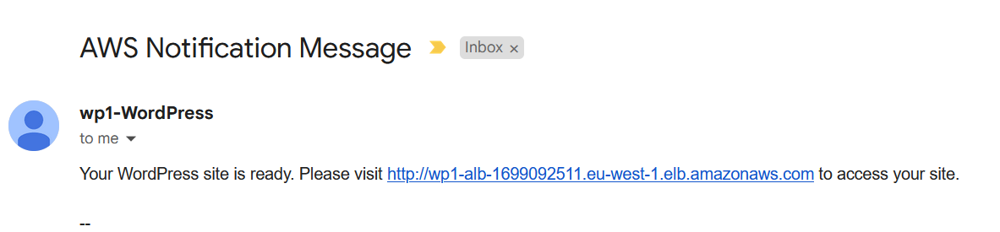

# Week 2 Assignment: WordPress with ELB, ASG, EFS, and RDS

## Overview

In this assignment, I will be deploying a WordPress site using the following AWS services: Elastic Load Balancer (ELB), Auto Scaling Group (ASG), Elastic File System (EFS), and Relational Database Service (RDS). I will also be using CloudFormation to automate the deployment of the infrastructure.

## Motivation

The motivation behind this assignment is to learn how to deploy a web application using AWS services. I will be using CloudFormation to automate the deployment of the infrastructure. By decupling the various components of the application, I will be able to scale the application more efficiently. This will also allow me to move the parts of the application to different environments.

The idea is to separate the application into traditional three-tier architecture. The web tier will be deployed using an ELB and an ASG. The application tier will be deployed using an EFS. The database tier will be deployed using an RDS.

## Architecture

The architecture of the application is shown below.
Everything starts and deployed using CloudFormation.

* The provisioning EC2 will download the WordPress application to EFS and configure the application to use the RDS database.
* Admin is notified via SNS when the application is ready.
* The provisioning EC2 is terminated after the application is ready.

* The application is deployed in a VPC with tree subnets.

* Both EFS and RDS are secured using its own security groups and the inbound traffic rule is set to allow traffic only if the service is in the same security group.

* The ELB is configured to listen on port 80 and forward the traffic to the instances in the ASG on port 80.

* The ASG is configured to listen on port 80 and forward the traffic to the instances on port 80.

* The instances in the ASG are configured to mount the EFS on the `/var/www/html` directory.

### 2D Architecture Diagram


### 3D Architecture Diagram


## Important Notes

### Dependencies

Some resources take longer time to provision. For example, EFS and RDS. In order to make sure that the provisioning EC2 does not fail, I have explicitly added `DependsOn` to the resources that are depended on. This will make sure that required resources are provisioned before the provisioning EC2 starts.

This is especially important for User Data scripts that are dependent on other resources. For example, the provisioning EC2 is dependent on the EFS mount. The provisioning EC2 will fail if the EFS is not mounted before the provisioning EC2 starts.

The same applies to the `AutoScalingLaunchTemplate`. Its important to have the Provisioning EC2 provisioned before the `AutoScalingLaunchTemplate` starts. This is because the WordPress application is downloaded to the EFS and configured to use the RDS database by the provisioning EC2.

### Security Groups that Allow Traffic from the Same Security Group

You cannot add a security group as a source to itself. For example, the EFS security group cannot be added as a source to itself. This is because the security group is not created yet. The workaround is to create the security group resource without any rules and then create a SecurityGroupIngress resource to add the rules and add the security group as a source.

An example of this is the `RDSSecurityGroup` and `RDSIngressRule` resources.

```yaml
Resources:
  # This Creates the Security Group without any rules
  RDSSecurityGroup:
    Type: AWS::EC2::SecurityGroup
    Properties:
      GroupDescription: "allow-rds-traffic"
      VpcId: !Ref myVPC

  # This creates the rule and adds the security group as a source
  # By doing this, the inbound traffic is allowed from the specified security group only
  # Meaning that the security group needs to be attached to the resource that needs to access RDS in this case
  RDSIngressRule:
    Type: AWS::EC2::SecurityGroupIngress
    Properties:
      GroupId: !Ref RDSSecurityGroup # Here we specify the security group that we want to add the rule to
      IpProtocol: tcp
      FromPort: 3306
      ToPort: 3306
      SourceSecurityGroupId: !Ref RDSSecurityGroup # Here we add the security group as a source
```

### Provisioning EC2 User Data Explained

```bash
#!/bin/bash -xe
yum update -y
# Install Apache, PHP, and EFS utils
yum install -y httpd wget php-fpm php-mysqli php-json php php-devel amazon-efs-utils
systemctl start httpd php-fpm
systemctl enable httpd php-fpm
# Mount EFS to /var/www/html after the network is available (_netdev)
echo "${EFSFileSystem}:/ /var/www/html/ efs _netdev,noresvport,tls 0 0" | tee -a /etc/fstab
mount -a
# Download and install wp-cli. This is used to download and configure the WordPress application
curl -O https://raw.githubusercontent.com/wp-cli/builds/gh-pages/phar/wp-cli.phar
chmod +x wp-cli.phar
sudo mv wp-cli.phar /bin/wp
echo "Waiting 30 seconds for efs to mount..."
sleep 30
cd /var/www/html
# Download WordPress application
wp core download --path=/var/www/html --allow-root --force
# Wait for wp-config-sample.php to be found. This is downloaded by the previous command and renamed to wp-config.php
while [ ! -f /var/www/html/wp-config-sample.php ]; do sleep 2; done
mv /var/www/html/wp-config-sample.php /var/www/html/wp-config.php -f
# Configure WordPress to use the RDS database
wp core config --path="/var/www/html" --allow-root --dbhost="${RDSEndpoint}" \
--dbname="${DBName}" --dbuser="${DBUsername}" --dbpass="${DBPassword}" --dbprefix="wp_" --force
# Install WordPress application with the specified title, admin username, password, and email
wp core install --allow-root --url="http://${ApplicationLoadBalancerDNS}" --title="${WordPressSiteTitle}" \
--admin_user="${WordPressAdminUsername}" --admin_password=${WordPressAdminPassword} --admin_email="${WordPressAdminEmail}"
chown -R apache:apache /var/www/html
chmod -R 2755 /var/www/html

EXPECTED_TITLE="${WordPressSiteTitle}"
max_retries=40
retry_count=0

# Wait for the WordPress application to be ready. This is done by checking the title of the page.
# The url is http://<ApplicationLoadBalancerDNS> and the title is <WordPressSiteTitle>
# The script will wait for 30 seconds and then check the title again. This will be repeated until the title is found or the max retries is reached.
# If the max retries is reached, the script will exit.
# If the title is found, the admin is notified via SNS and the provisioning EC2 is terminated.
while [ $retry_count -lt $max_retries ]; do
    ACTUAL_TITLE=$(curl http://${ApplicationLoadBalancerDNS} | grep -e "<title>.*</title>" | sed -e 's/<[^>]*>//g')
    if [ "$ACTUAL_TITLE" != "$EXPECTED_TITLE" ]; then
        sleep 30
        ((retry_count++))
    else
        aws sns publish --topic-arn ${SNSTopic} --message "Your WordPress site is ready. Please visit http://${ApplicationLoadBalancerDNS} to access your site."
        shutdown now -h
        break
    fi
done

if [ $retry_count -eq $max_retries ]; then
    echo "Maximum retries reached."
fi
```

## Usage

### Prerequisites

* AWS CLI
* AWS Account
* AWS IAM User with Administrator Access
* AWS CLI Configured with the IAM User

### Steps

1. Create a CloudFormation stack using the `wordpress-elb-asg-efs-rds.yaml` template.
2. Wait for the stack to be created.
3. Confirm the SNS subscription in your email. This is required to receive the notification when the WordPress site is ready.

4. Wait for the provisioning EC2 to be terminated.
5. Check your email for the SNS notification.

6. Visit the URL in the SNS notification to access the WordPress site.

7. The stack resources can be found under `saved Resource Groups` in the AWS Console.


## Complete CloudFormation Template

```yaml
---
AWSTemplateFormatVersion: 2010-09-09
Description: >
  Create a WordPress site with an Application Load Balancer, Auto Scaling Group, EFS, RDS.
  The WordPress site is provisioned using a Launch Template and a CloudFormation EC2 instance.
  A provisioner EC2 instance is used to provision the WordPress site, including the database setup to RDS and the EFS mount.
  The provisioner EC2 instance is terminated after the WordPress site is provisioned.
  The WordPress site is accessible via the Application Load Balancer.
  The application is decoupled from the data layer, which is stored in RDS and EFS, making it easy to scale the application layer.

Parameters:
  ParamEnvironment:
    Type: String
    Default: dev
    AllowedValues:
      - dev
      - prod
    Description: Environment to deploy to (dev or prod)
    ConstraintDescription: must be either dev or prod.

  DBInstanceIdentifier:
    Default: dbinstance
    Description: My database instance
    Type: String
    MinLength: "1"
    MaxLength: "63"
    AllowedPattern: "[a-zA-Z0-9]*[a-zA-Z0-9]*"
    ConstraintDescription: >-
      Must begin with a letter and must not end with a hyphen or contain two
      consecutive hyphens.

  DBAllocatedStorage:
    Default: "20"
    Description: The size of the database (GiB)
    Type: Number
    MinValue: "20"
    MaxValue: "120"
    ConstraintDescription: must be between 20 and 65536 GiB.

  DBName:
    Default: wordpressdb
    Description: My database
    Type: String
    MinLength: "1"
    MaxLength: "64"
    AllowedPattern: "[a-zA-Z][a-zA-Z0-9]*"
    ConstraintDescription: Must begin with a letter and contain only alphanumeric characters.

  DBUsername:
    Default: "admin"
    NoEcho: "true"
    Description: Username for MySQL database access
    Type: String
    MinLength: "1"
    MaxLength: "16"
    AllowedPattern: "[a-zA-Z][a-zA-Z0-9]*"
    ConstraintDescription: must begin with a letter and contain only alphanumeric characters.

  DBPassword:
    Default: "MyInsecurePassword"
    NoEcho: "true"
    Description: Password MySQL database access
    Type: String
    MinLength: "8"
    MaxLength: "41"
    AllowedPattern: "[a-zA-Z0-9]*"
    ConstraintDescription: must contain only alphanumeric characters.

  WordPressSiteTitle:
    Default: "My WordPress Site"
    Description: The title of the WordPress site
    Type: String
    MinLength: "4"
    MaxLength: "64"
    ConstraintDescription: Must be between 4 - 64 characters.

  WordPressAdminUsername:
    Default: "admin"
    Description: Username for WordPress admin access
    Type: String
    MinLength: "5"
    MaxLength: "16"
    AllowedPattern: "[a-zA-Z][a-zA-Z0-9]*"
    ConstraintDescription: must begin with a letter and contain only alphanumeric characters.

  WordPressAdminPassword:
    Default: "MyInsecurePassword"
    NoEcho: "true"
    Description: Password for WordPress admin access
    Type: String
    MinLength: "8"
    MaxLength: "41"
    AllowedPattern: "[a-zA-Z0-9]*"
    ConstraintDescription: must contain only alphanumeric characters.

  WordPressAdminEmail:
    Default: "user@example.com"
    Description: Email for WordPress admin access
    Type: String
    MinLength: "5"
    MaxLength: "64"
    ConstraintDescription: must contain only alphanumeric characters.

  DBInstanceClass:
    Default: db.t3.micro
    Description: DB instance class
    Type: String
    ConstraintDescription: Must select a valid DB instance type.

  ParamAutoscalingDesiredCapacity:
    Type: Number
    Default: 2
    Description: Desired number of EC2 instances for autoscaling group

  ParamAutoscalingMaxSize:
    Type: Number
    Default: 4
    Description: Maximum number of EC2 instances for autoscaling group

  ParamAutoscalingMinSize:
    Type: Number
    Default: 1
    Description: Minimum number of EC2 instances for autoscaling group

  ParamAutoscalingScaleUpThreshold:
    Type: Number
    Default: 80
    MinValue: 50
    MaxValue: 100
    Description: CPU utilization threshold for scaling up
    ConstraintDescription: must be a number between 50 and 100.

Mappings:
  RegionMap:
    # Details for eu-west-1
    eu-west-1:
      InstanceType: t2.micro
      AMI: ami-0f3164307ee5d695a
      SSHKeyName: aws_rsa.pub
    # Details for eu-north-1
    eu-north-1:
      InstanceType: t3.micro
      AMI: ami-071df4a41c6f9ee2e
      SSHKeyName: aws_rsa.pub

Resources:

########################## SNS ##########################
# Create IAM Role to Send SNS on the EC2
  SNSRole:
    Type: AWS::IAM::Role
    Properties:
      RoleName: !Sub "${AWS::StackName}-SNSRole"
      AssumeRolePolicyDocument:
        Version: 2012-10-17
        Statement:
          - Effect: Allow
            Principal:
              Service:
                - ec2.amazonaws.com
            Action:
              - sts:AssumeRole
      Path: "/"
      Policies:
        - PolicyName: !Sub "${AWS::StackName}-SNSPolicy"
          PolicyDocument:
            Version: 2012-10-17
            Statement:
              - Effect: Allow
                Action:
                  - sns:Publish
                Resource: "*"

# Create an IAM Instance Profile for SNS Role
  SNSInstanceProfile:
    Type: AWS::IAM::InstanceProfile
    Properties:
      InstanceProfileName: !Sub "${AWS::StackName}-SNSInstanceProfile"
      Path: "/"
      Roles:
        - !Ref SNSRole

# Create a sns topic
  SNSTopic:
    Type: AWS::SNS::Topic
    Properties:
      DisplayName: !Sub "${AWS::StackName}-WordPress"
      Subscription:
        - Endpoint: !Ref WordPressAdminEmail
          Protocol: email

# Create a sns topic subscription
  SNSTopicSubscription:
    Type: AWS::SNS::Subscription
    Properties:
      Endpoint: !Ref WordPressAdminEmail
      Protocol: email
      TopicArn: !Ref SNSTopic

  ############################# VPC #############################
  myVPC:
    Type: AWS::EC2::VPC
    Properties:
      CidrBlock: 10.0.0.0/16
      EnableDnsSupport: truev
      EnableDnsHostnames: true
      InstanceTenancy: default
      Tags:
        - Key: Name
          Value: !Sub "${AWS::StackName}-VPC"
        - Key: Environment
          Value: !Sub "${AWS::StackName}-${ParamEnvironment}"

  InternetGateway:
    Type: AWS::EC2::InternetGateway
    DependsOn: myVPC
    Properties:
      Tags:
        - Key: Name
          Value: !Sub "${AWS::StackName}-InternetGateway"
        - Key: Environment
          Value: !Sub "${AWS::StackName}-${ParamEnvironment}"

  AttachGateway:
    Type: AWS::EC2::VPCGatewayAttachment
    Properties:
      VpcId: !Ref myVPC
      InternetGatewayId: !Ref InternetGateway

  ############################# PUBLIC SUBNETS #############################
  PublicSubnetA:
    Type: AWS::EC2::Subnet
    Properties:
      AvailabilityZone: !Select
        - 0
        - Fn::GetAZs: !Ref AWS::Region
      VpcId: !Ref myVPC
      CidrBlock: 10.0.0.0/20
      MapPublicIpOnLaunch: true
      Tags:
        - Key: Name
          Value: !Sub "${AWS::StackName}-PublicSubnetA"
        - Key: Environment
          Value: !Sub "${AWS::StackName}-${ParamEnvironment}"

  PublicSubnetB:
    Type: AWS::EC2::Subnet
    Properties:
      AvailabilityZone: !Select
        - 1
        - Fn::GetAZs: !Ref AWS::Region
      VpcId: !Ref myVPC
      CidrBlock: 10.0.16.0/20
      MapPublicIpOnLaunch: true
      Tags:
        - Key: Name
          Value: !Sub "${AWS::StackName}-PublicSubnetB"
        - Key: Environment
          Value: !Sub "${AWS::StackName}-${ParamEnvironment}"

  PublicSubnetC:
    Type: AWS::EC2::Subnet
    Properties:
      AvailabilityZone: !Select
        - 2
        - Fn::GetAZs: !Ref AWS::Region
      VpcId: !Ref myVPC
      CidrBlock: 10.0.32.0/20
      MapPublicIpOnLaunch: true
      Tags:
        - Key: Name
          Value: !Sub "${AWS::StackName}-PublicSubnetC"
        - Key: Environment
          Value: !Sub "${AWS::StackName}-${ParamEnvironment}"

  ############################# ROUTE TABLES #############################
  PublicRouteTable:
    Type: AWS::EC2::RouteTable
    Properties:
      VpcId: !Ref myVPC
      Tags:
        - Key: Name
          Value: !Sub "${AWS::StackName}-PublicRouteTable"
        - Key: Environment
          Value: !Sub "${AWS::StackName}-${ParamEnvironment}"

  # Public route table has direct routing to IGW
  PublicRoute:
    Type: AWS::EC2::Route
    DependsOn: AttachGateway
    Properties:
      RouteTableId: !Ref PublicRouteTable
      DestinationCidrBlock: 0.0.0.0/0
      GatewayId: !Ref InternetGateway

  ############################# ROUTE TABLE ASSOCIATIONS #############################
  PublicSubnetARouteTableAssociation:
    Type: AWS::EC2::SubnetRouteTableAssociation
    Properties:
      SubnetId: !Ref PublicSubnetA
      RouteTableId: !Ref PublicRouteTable

  PublicSubnetBRouteTableAssociation:
    Type: AWS::EC2::SubnetRouteTableAssociation
    Properties:
      SubnetId: !Ref PublicSubnetB
      RouteTableId: !Ref PublicRouteTable

  PublicSubnetCRouteTableAssociation:
    Type: AWS::EC2::SubnetRouteTableAssociation
    Properties:
      SubnetId: !Ref PublicSubnetC
      RouteTableId: !Ref PublicRouteTable

########################## RDS ##########################
  RDSSecurityGroup:
    Type: AWS::EC2::SecurityGroup
    Properties:
      GroupDescription: "allow-rds-traffic"
      VpcId: !Ref myVPC

  RDSIngressRule:
    Type: AWS::EC2::SecurityGroupIngress
    Properties:
      GroupId: !Ref RDSSecurityGroup
      IpProtocol: tcp
      FromPort: 3306
      ToPort: 3306
      SourceSecurityGroupId: !Ref RDSSecurityGroup

  RDSSubnetGroup:
    Type: AWS::RDS::DBSubnetGroup
    Properties:
      DBSubnetGroupDescription: "Subnet group for RDS"
      SubnetIds:
        - !Ref PublicSubnetA
        - !Ref PublicSubnetB
        - !Ref PublicSubnetC
      Tags:
        - Key: Name
          Value: !Sub "${AWS::StackName}-RDSSubnetGroup"
        - Key: Environment
          Value: !Sub "${AWS::StackName}${ParamEnvironment}"

  RDSInstance:
    Type: AWS::RDS::DBInstance
    DependsOn: AttachGateway
    Properties:
      DBSubnetGroupName: !Ref RDSSubnetGroup
      VPCSecurityGroups:
        - !Ref RDSSecurityGroup
      DBInstanceIdentifier: !Sub "${AWS::StackName}-${DBInstanceIdentifier}"
      DBName: !Ref DBName
      DBInstanceClass: !Ref DBInstanceClass
      AllocatedStorage: !Ref DBAllocatedStorage
      Engine: MySQL
      EngineVersion: "8.0.33"
      MasterUsername: !Ref DBUsername
      MasterUserPassword: !Ref DBPassword
      PubliclyAccessible: true
      DeleteAutomatedBackups: true
    UpdateReplacePolicy: Delete
    DeletionPolicy: Delete

  ########################## EFS ##########################

  # Create an EFS File System Security Group allowing NFS traffic
  EFSSecurityGroup:
    Type: AWS::EC2::SecurityGroup
    Properties:
      GroupDescription: "allow-efs-traffic"
      VpcId: !Ref myVPC

  EFSIngressRule:
    Type: AWS::EC2::SecurityGroupIngress
    Properties:
      GroupId: !Ref EFSSecurityGroup
      IpProtocol: tcp
      FromPort: 2049
      ToPort: 2049
      SourceSecurityGroupId: !Ref EFSSecurityGroup

  EFSFileSystem:
    Type: AWS::EFS::FileSystem
    DependsOn: AttachGateway
    DeletionPolicy: Delete
    # UpdateReplacePolicy: Delete
    Properties:
      Encrypted: true
      LifecyclePolicies:
        - TransitionToIA: AFTER_7_DAYS
        - TransitionToPrimaryStorageClass: AFTER_1_ACCESS
      FileSystemTags:
        - Key: Name
          Value: !Ref AWS::StackName
      PerformanceMode: generalPurpose
      ThroughputMode: elastic

  MountTargetResource1:
    Type: AWS::EFS::MountTarget
    Properties:
      FileSystemId: !Ref EFSFileSystem
      SubnetId: !Ref PublicSubnetA
      SecurityGroups:
        - !Ref EFSSecurityGroup

  MountTargetResource2:
    Type: AWS::EFS::MountTarget
    Properties:
      FileSystemId: !Ref EFSFileSystem
      SubnetId: !Ref PublicSubnetB
      SecurityGroups:
        - !Ref EFSSecurityGroup

  MountTargetResource3:
    Type: AWS::EFS::MountTarget
    Properties:
      FileSystemId: !Ref EFSFileSystem
      SubnetId: !Ref PublicSubnetC
      SecurityGroups:
        - !Ref EFSSecurityGroup

  ########################## APPLICATION LB ##########################

    # ELB Security Group allowing Port 80 from anywhere
  ApplicationLoadBalancerSG:
    Type: AWS::EC2::SecurityGroup
    Properties:
      GroupDescription: "Security Group for Application Load Balancer"
      VpcId: !Ref myVPC
      SecurityGroupIngress:
        - IpProtocol: tcp
          FromPort: 80
          ToPort: 80
          CidrIp: 0.0.0.0/0
      Tags:
        - Key: Environment
          Value: !Sub "${AWS::StackName}-${ParamEnvironment}"


    # Creating an Application Load Balancer
  ApplicationLoadBalancer:
    Type: AWS::ElasticLoadBalancingV2::LoadBalancer
    DependsOn: AttachGateway
    Properties:
      Name: !Sub "${AWS::StackName}-alb"
      Scheme: internet-facing
      Subnets: 
        - !Ref PublicSubnetA
        - !Ref PublicSubnetB
        - !Ref PublicSubnetC
      SecurityGroups:
        - !Ref ApplicationLoadBalancerSG
      Type: application
      IpAddressType: ipv4
      Tags:
        - Key: Name
          Value: !Sub "${AWS::StackName}-ApplicationLoadBalancer"
        - Key: Environment
          Value: !Sub "${AWS::StackName}-${ParamEnvironment}"

  ProvisionTemplateSG:
    Type: AWS::EC2::SecurityGroup
    Properties:
      GroupDescription: "Allow SSH and HTTP traffic"
      VpcId: !Ref myVPC
      SecurityGroupIngress:
        - IpProtocol: tcp
          FromPort: 80
          ToPort: 80
          CidrIp: 0.0.0.0/0
        - IpProtocol: tcp
          FromPort: 22
          ToPort: 22
          CidrIp: 0.0.0.0/0
      Tags:
        - Key: Environment
          Value: !Sub "${AWS::StackName}-${ParamEnvironment}"

  # Creating a Launch Template
  ProvisionTemplate:
    Type: AWS::EC2::LaunchTemplate
    DependsOn: 
      - MountTargetResource1
      - MountTargetResource2
      - MountTargetResource3
    Properties:
      LaunchTemplateName: !Sub "${AWS::StackName}-EC2LaunchTemplate"
      LaunchTemplateData:
        ImageId:
          !FindInMap [RegionMap, !Ref "AWS::Region", AMI]
        InstanceType: !FindInMap [RegionMap, !Ref "AWS::Region", InstanceType]
        KeyName: !FindInMap [RegionMap, !Ref "AWS::Region", SSHKeyName]
        SecurityGroupIds:
          - !Ref ProvisionTemplateSG
          - !Ref EFSSecurityGroup
          - !Ref RDSSecurityGroup
        TagSpecifications:
          - ResourceType: instance
            Tags:
              - Key: Name
                Value: !Sub "${AWS::StackName}-wordpress-provision-template"
              - Key: Environment
                Value: !Sub "${AWS::StackName}-${ParamEnvironment}"
        UserData: 
          Fn::Base64: 
            Fn::Sub: 
              - |
                #!/bin/bash -xe
                yum update -y
                yum install -y httpd wget php-fpm php-mysqli php-json php php-devel amazon-efs-utils
                systemctl start httpd php-fpm
                systemctl enable httpd php-fpm
                echo "${EFSFileSystem}:/ /var/www/html/ efs _netdev,noresvport,tls 0 0" | tee -a /etc/fstab
                mount -a
                curl -O https://raw.githubusercontent.com/wp-cli/builds/gh-pages/phar/wp-cli.phar
                chmod +x wp-cli.phar
                sudo mv wp-cli.phar /bin/wp
                echo "Waiting 30 seconds for efs to mount..."
                sleep 30
                cd /var/www/html
                wp core download --path=/var/www/html --allow-root --force
                while [ ! -f /var/www/html/wp-config-sample.php ]; do sleep 2; done
                mv /var/www/html/wp-config-sample.php /var/www/html/wp-config.php -f
                wp core config --path="/var/www/html" --allow-root --dbhost="${RDSEndpoint}" \
                --dbname="${DBName}" --dbuser="${DBUsername}" --dbpass="${DBPassword}" --dbprefix="wp_" --force
                wp core install --allow-root --url="http://${ApplicationLoadBalancerDNS}" --title="${WordPressSiteTitle}" \
                --admin_user="${WordPressAdminUsername}" --admin_password=${WordPressAdminPassword} --admin_email="${WordPressAdminEmail}"
                chown -R apache:apache /var/www/html
                chmod -R 2755 /var/www/html

                EXPECTED_TITLE="${WordPressSiteTitle}"
                max_retries=40
                retry_count=0

                while [ $retry_count -lt $max_retries ]; do
                    ACTUAL_TITLE=$(curl http://${ApplicationLoadBalancerDNS} | grep -e "<title>.*</title>" | sed -e 's/<[^>]*>//g')
                    if [ "$ACTUAL_TITLE" != "$EXPECTED_TITLE" ]; then
                        sleep 30
                        ((retry_count++))
                    else
                        aws sns publish --topic-arn ${SNSTopic} --message "Your WordPress site is ready. Please visit http://${ApplicationLoadBalancerDNS} to access your site."
                        shutdown now -h
                        break
                    fi
                done

                if [ $retry_count -eq $max_retries ]; then
                    echo "Maximum retries reached."
                fi
              - RDSEndpoint: !GetAtt RDSInstance.Endpoint.Address
                ApplicationLoadBalancerDNS: !GetAtt ApplicationLoadBalancer.DNSName
                EFSFileSystem: !Ref EFSFileSystem
                SNSTopic: !Ref SNSTopic
                WordPressSiteTitle: !Ref WordPressSiteTitle

  # Create a EC2 Based on Provision Launch Template
  WordpressProvioner:
    Type: AWS::EC2::Instance
    Properties:
      # This Role is used to be able to send SNS message
      IamInstanceProfile: !Ref SNSInstanceProfile
      # Terminate the instance when the provisioning is done
      InstanceInitiatedShutdownBehavior: terminate
      SubnetId: !Ref PublicSubnetA
      LaunchTemplate:
        LaunchTemplateId: !Ref ProvisionTemplate
        Version: !GetAtt ProvisionTemplate.LatestVersionNumber
      Tags:
        - Key: Name
          Value: !Sub "${AWS::StackName}-wordpress-provioner"
        - Key: Environment
          Value: !Sub "${AWS::StackName}-${ParamEnvironment}"

  # EC2 Security Group Allowing Port 80 through the Load Balancer Security Group
  AutoScalingSecurityGroup:
    Type: AWS::EC2::SecurityGroup
    Properties:
      GroupDescription: "Allow SSH and HTTP access to ec2 instances"
      VpcId: !Ref myVPC
      # Security Group Ingress for SSH and HTTP
      SecurityGroupIngress:
        # HTTP access from ELB Security Group only
        - IpProtocol: tcp
          FromPort: 80
          ToPort: 80
          SourceSecurityGroupId:
            Ref: ApplicationLoadBalancerSG
      Tags:
        - Key: Environment
          Value: !Sub "${AWS::StackName}-${ParamEnvironment}"

  # AutoScaling Launch Template
  AutoScalingLaunchTemplate:
    Type: AWS::EC2::LaunchTemplate
    DependsOn:
      - WordpressProvioner
    Properties:
      LaunchTemplateName: !Sub "${AWS::StackName}-ASGLaunchTemplate"
      LaunchTemplateData:
        ImageId:
          !FindInMap [RegionMap, !Ref "AWS::Region", AMI]
        InstanceType: !FindInMap [RegionMap, !Ref "AWS::Region", InstanceType]
        KeyName: !FindInMap [RegionMap, !Ref "AWS::Region", SSHKeyName]
        SecurityGroupIds:
          - !Ref AutoScalingSecurityGroup
          - !Ref EFSSecurityGroup
          - !Ref RDSSecurityGroup
        TagSpecifications:
          - ResourceType: instance
            Tags:
              - Key: Name
                Value: !Sub "${AWS::StackName}-Autoscaling-instance"
              - Key: Environment
                Value: !Sub "${AWS::StackName}-${ParamEnvironment}"
        UserData: 
          Fn::Base64: 
            Fn::Sub: 
              - |
                #!/bin/bash -xe
                yum update -y
                yum install -y httpd wget php-fpm php-mysqli php-json php php-devel amazon-efs-utils
                systemctl start httpd php-fpm
                systemctl enable httpd php-fpm
                echo "${EFSFileSystem}:/ /var/www/html/ efs _netdev,noresvport,tls 0 0" | tee -a /etc/fstab
                mount -a
                chown -R apache:apache /var/www/html
                chmod -R 2755 /var/www/html
              - EFSFileSystem: !Ref EFSFileSystem

  # Creating a Target Group
  AutoScalingTargetGroup:
    Type: AWS::ElasticLoadBalancingV2::TargetGroup
    DependsOn: 
      - ApplicationLoadBalancer
      - AutoScalingLaunchTemplate
    Properties:
      HealthCheckIntervalSeconds: 30
      HealthCheckPath: /index.html
      HealthCheckProtocol: HTTP
      HealthCheckTimeoutSeconds: 5
      HealthyThresholdCount: 2
      Matcher:
        HttpCode: 200
      Name: !Sub "${AWS::StackName}-ASGTargetGroup"
      Port: 80
      Protocol: HTTP
      ProtocolVersion: HTTP1
      UnhealthyThresholdCount: 2
      VpcId: !Ref myVPC
      Tags:
        - Key: Environment
          Value: !Sub "${AWS::StackName}-${ParamEnvironment}"

  # Creating an Application Load Balancer Listener, forwarding traffic to the target group
  # and specifying the load balancer port and protocol 
  HTTPlistener:
    Type: "AWS::ElasticLoadBalancingV2::Listener"
    Properties:
      DefaultActions:
        - Type: "forward"
          ForwardConfig:
            TargetGroups:
              - TargetGroupArn: !Ref AutoScalingTargetGroup
                Weight: 1
      LoadBalancerArn: !Ref ApplicationLoadBalancer
      Port: 80
      Protocol: "HTTP"

  #Creating autoscaling group with desired minimum and maximum size
  AutoScalingGroup:
    Type: AWS::AutoScaling::AutoScalingGroup
    DependsOn: 
      - HTTPlistener
      - WordpressProvioner
    Properties:
      AutoScalingGroupName: !Sub "${AWS::StackName}-AutoScalingGroup"
      LaunchTemplate:
        LaunchTemplateId: !Ref AutoScalingLaunchTemplate
        Version: !GetAtt AutoScalingLaunchTemplate.LatestVersionNumber
      MinSize: !Ref ParamAutoscalingMinSize
      MaxSize: !Ref ParamAutoscalingMaxSize
      DesiredCapacity: !Ref ParamAutoscalingDesiredCapacity
      VPCZoneIdentifier:
        - !Ref PublicSubnetA
        - !Ref PublicSubnetB
        - !Ref PublicSubnetC
      AvailabilityZones: 
        Fn::GetAZs: !Ref AWS::Region
      MetricsCollection:
        - Granularity: 1Minute
      TargetGroupARNs:
        - !Ref AutoScalingTargetGroup
      Tags:
        - Key: Environment
          Value: !Sub "${AWS::StackName}-${ParamEnvironment}"
          PropagateAtLaunch: true

  # Autoscaling Policy, scaling up when CPU utilization is above 80%
  AutoScalingPolicy:
    Type: AWS::AutoScaling::ScalingPolicy
    Properties:
      AutoScalingGroupName: !Ref AutoScalingGroup
      PolicyType: TargetTrackingScaling
      TargetTrackingConfiguration:
        PredefinedMetricSpecification:
          PredefinedMetricType: ASGAverageCPUUtilization
        TargetValue: !Ref ParamAutoscalingScaleUpThreshold

  # Create a resource group based on CloudFormation stack
  StackResourceGroup:
    Type: "AWS::ResourceGroups::Group" 
    Properties: 
      Name: "StackResourceGroup" 
      Description: "Resource group for the stack" 
      ResourceQuery: 
        Type: "CLOUDFORMATION_STACK_1_0"
      Tags:
        - Key: Type
          Value: "ResourceGroup"
        - Key: Environment
          Value: !Sub "${AWS::StackName}-${ParamEnvironment}"
        - Key: Name
          Value: !Sub "${AWS::StackName}-ResourceGroup"


Outputs:
  EFSFileSystemId:
    Description: EFS File System ID
    Value: !Ref EFSFileSystem
  RDSEndpoint:
    Description: RDS Endpoint
    Value: !GetAtt RDSInstance.Endpoint.Address
  ApplicationLoadBalancerDNS:
    Description: Application Load Balancer DNS
    Value: !GetAtt ApplicationLoadBalancer.DNSName
```
